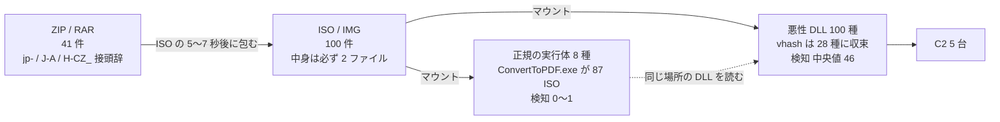
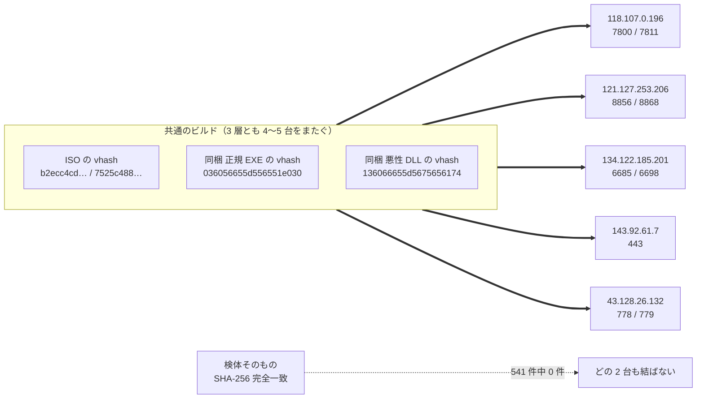
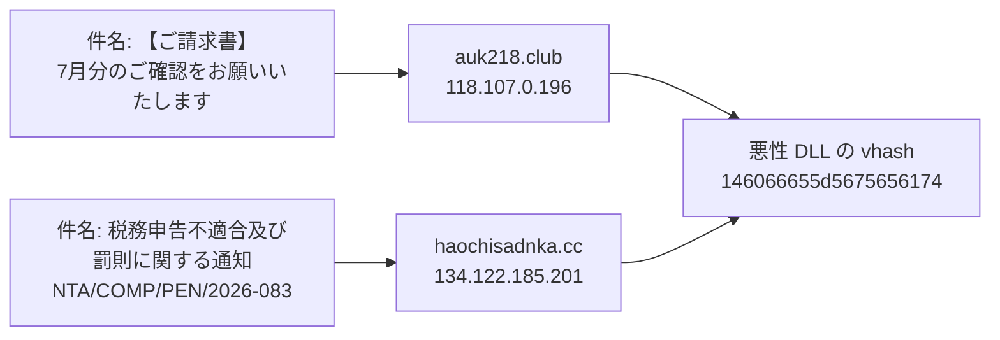
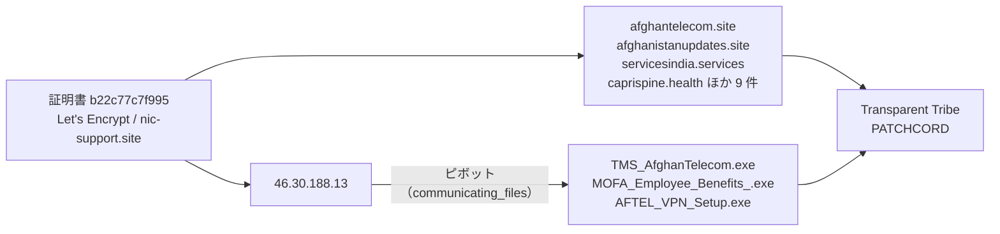
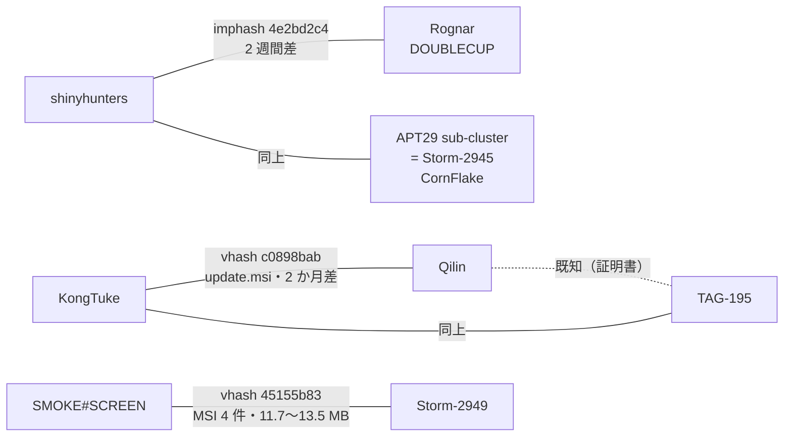
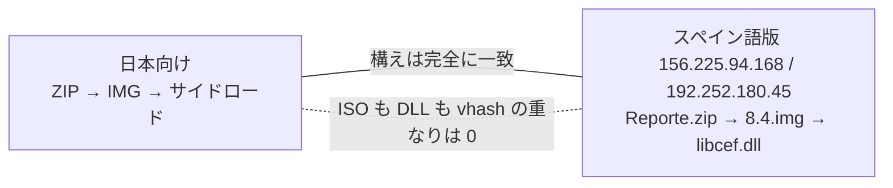

> **このレポートは AI（Claude）が自動生成したものです。人の確認を前提としてください。**

# 週次レポート 2026-W33（2026-08-09 〜 2026-08-15）

## 見つかったもの

**日本を狙った税・請求テーマの配布鎖**（ValleyRAT / Winos）。

書庫名の接頭辞（`jp-` `J-A` `H-CZ_` `HENS` `FG-`）が宛先を分けている。

**この作戦の 5 台目の C2 `43.128.26.132`。** 索引では `Silver Fox` としか付いていなかったが、
税 ISO の vhash `b2ecc4cda3dc7173` を 8 件持つ。検体が 2026-05-27 まで遡り、
6 月の `.com`/`.cmd` 拡張子 EXE から 8 月の ISO への変形が 1 台で追える。

**作っている側の稼働曜日。** ファイル名に埋まった 43 個のビルド時刻は
月 9 / 火 10 / 水 11 / 木 10 / 金 3 / **土 0 / 日 0**。週休二日で金曜は早じまい。
これは提出日ではなく作った側の時計なので、解析者の稼働曜日とは独立している。

**Transparent Tribe のアフガニスタン・インド向け作戦。**
共有証明書 `b22c77c7f995`（Let's Encrypt / `nic-support.site`）が 14 IOC を束ねている。

**索引に無い検体 3,584 件**（ピボット 299 的 / API 712 回）。

---

## つながったもの

### 税 ISO の 5 台は 1 つの運用

**独立した 3 つの層**で同じ値が 5 台をまたぐ。一方で検体そのもの（SHA-256 完全一致）が
2 台にまたがる例は 541 件中ゼロ。**作るものは共通で、出来上がりを 1 台ずつ割り振っている。**

### 件名も C2 も違う 2 通が、同じビルドから出ている

### ドメイン 4 件が同じ窓口から同時に取られている

`auk218.club` `haochisadnka.cc` `ljdnxz.cc` `datusha.com.cn` が
登録者 **22net, Inc.**・NS **`ns1/ns2.22.cn`** で揃い、作成日が 2026-07-23〜27 の **5 日以内**。
検体側とは完全に独立した層で同じ運用が見えている。

### 証明書側と検体側が同じ IP で合流した

証明書からと検体から、別々に同じ作戦へ着地した。

### 新しいアクター間の橋（人の確認待ち）

`Qilin ↔ TAG-195` は既に証明書で繋がっている組。そこに KongTuke が入る形で、
ランサムの affiliate 関係かもしれない。`shinyhunters` の側は DOUBLECUP と CornFlake という
ClickFix 系どうしが繋がっている。

**関係ではなく索引の問題:** `Silver Fox` と `SilverFox APT` は同一アクターが 2 つの名前で入っている。

---

## そこから得られそうなもの

- **vhash `136066655d5675656174` を索引の外に当てる。** 税 ISO の悪性 DLL で、
  現時点で 4 台の C2 をまたいでいる。同じ値が別の C2 からも出るなら、この運用の広がりが測れる
- **`ConvertToPDF.exe`（vhash `036056655d556551e030`）の調達元。**
  87 ISO を支えている正規バイナリがどこから来ているかが決まる
- **`b22c77c7f995` の 13 ドメインをピボット元にする。**
  Transparent Tribe の作戦を証明書側から検体側へ広げられる
- **スペイン語版の `libcef.dll`（vhash `115046655d156058z4dh`）から第 3・第 4 の言語版を探す。**
  日本向けと重ならないことは確認済み。他の言語版がいるかは未見
- **検体をひとつも持たないアクターが 108 / 247 いる。**
  IP をピボットすると 93% の的が何かを返すので、ここは埋められる

---

## 疑い

- **`1aae8bf5`（`Chatty Spider ↔ X3D MINER` / `The Gentlemen`）は割れソフト系スタブの衝突かもしれない。**
  同じ imphash を持つ検体に `Ableton Live 12 Suite License.exe` がある
- **`88016fcd`（`Rognar ↔ Transparent Tribe` ほか）はサイズが 2.3 MB〜65 MB と 28 倍開いている。**
  Electron / NSIS インストーラの imphash である可能性が残る
- **ポート差 +11 / +12 / +13 が運用者の連番だという読みは弱くなった。**
  同じ税 ISO 群の `43.128.26.132` が **+1** を使っていた。
  ただしポートの記録は当時のもので現在値とは限らない
- **`imphash f34d5f2d4577ed6d…` に寄りかかっていた 3 本を撤回した。**
  索引全体で 432 IOC / 24 アクターに付いており、根拠にならない。
  これにより合流グラフの最大成分は 14 台 → 11 台になり、
  スペイン語版の 3 台が独立した成分に分かれた（読みとしてはむしろ整合が取れた）

### スペイン語版は「手口が同じでビルドが別」までしか言えない

同じ道具が複数の手に渡っているのか、同じ運用者の別ラインなのかは、この材料では決められない。