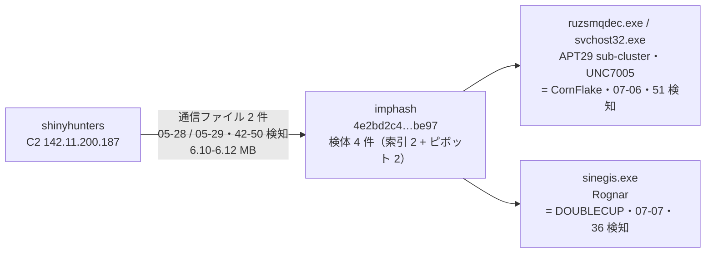
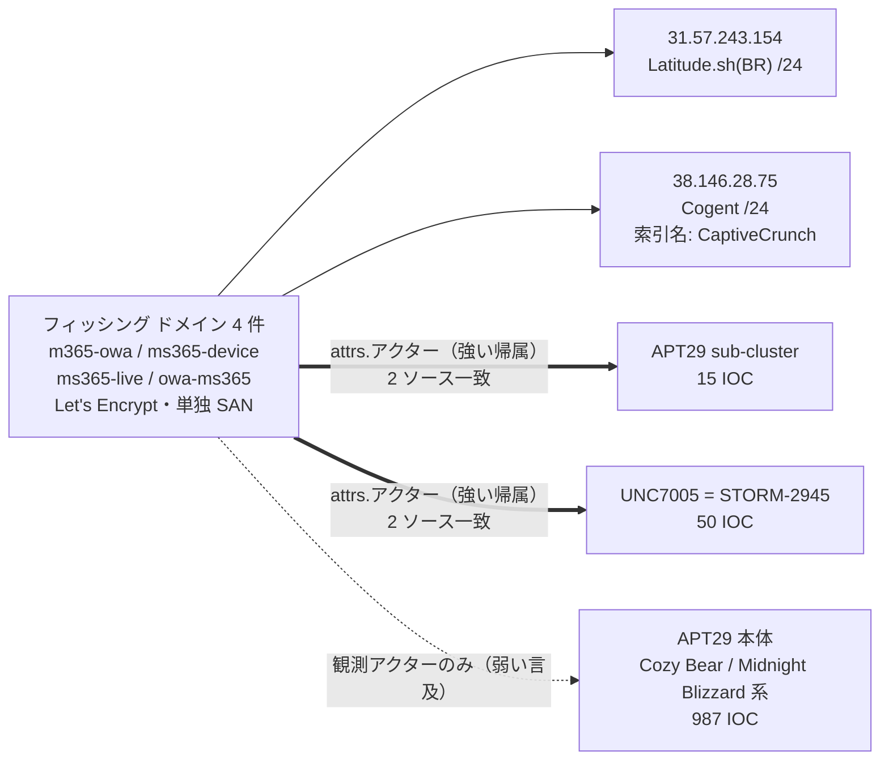
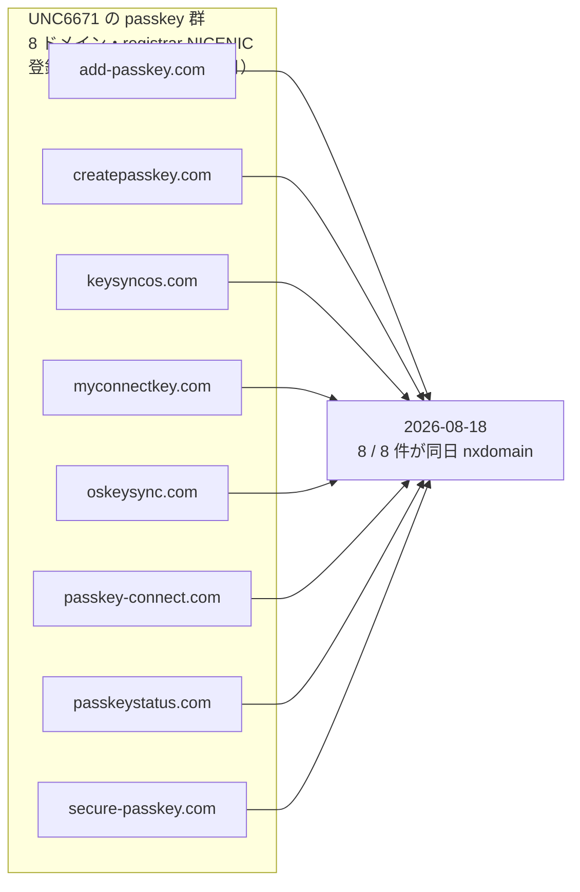
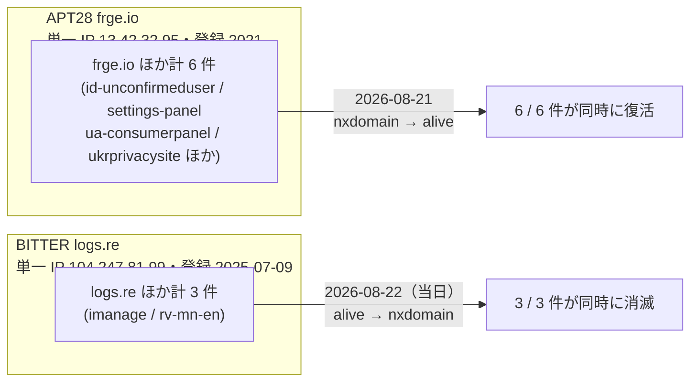

> **このレポートは AI（Claude）が自動生成したものです。人の確認を前提としてください。**

# 週次レポート 2026-W34（2026-08-16 〜 2026-08-22）

## 見つかったもの

**UNC7005（= STORM-2945）の「CaptiveCrunch」キャンペーン。** 出張者向け captive portal Wi-Fi の
悪用によるマルウェア配布・資格情報窃取として索引に記録されている作戦で、M365 を騙る
フィッシングドメイン 4 件（`m365-owa.com` `ms365-device.com` `ms365-live.com` `owa-ms365.com`、
いずれも Let's Encrypt の単独 SAN 証明書）と IP 4 件が紐づく。同じ 4 ドメイン + IP 2 件が、
別の索引ソースからは「APT29 sub-cluster」の名でも直接帰属されている（8 IOC 中 6 / 8）。

**UNC6671 の passkey フィッシングキット 8 ドメインが同日に一斉消滅。**
`add-passkey.com` `createpasskey.com` `keysyncos.com` `myconnectkey.com` `oskeysync.com`
`passkey-connect.com` `passkeystatus.com` `secure-passkey.com` の 8 件（全て registrar
NICENIC、2026-05-03〜07-21 の 2.5 か月にわたって順次登録）が、**2026-08-18 に全件 nxdomain**
になった（トラッカーのその日の status イベント 8 / 8）。

**BITTER の `logs.re` 系 3 サブドメインが本日（2026-08-22）消滅、APT28 の `frge.io` 系
6 サブドメインは 08-21 に復活。** 両者とも配下のサブドメインが単一 IP に集約されており
（`logs.re` 系は `104.247.81.99`、`frge.io` 系は `13.42.32.95`）、個別の名前解決ミスではなく
ホスト単位の生死切り替わりと読める。

**ピボットで拾った索引に無い検体 2,546 件**（今週新規。的 300 / API 348 回、空振り 127）。
ガードを通った橋 25 組のうち 21 組が新規。詳細は「つながったもの」と「疑い」へ。

---

## つながったもの

### shinyhunters が CornFlake（APT29 sub-cluster / UNC7005）と DOUBLECUP（Rognar）の imphash に繋がった

先週「人の確認待ち」としていたピボット候補（`shinyhunters ↔ APT29 sub-cluster`、
imphash 4 桁だけの弱い一致）が、今週 shinyhunters の C2 `142.11.200.187` と通信した
検体 2 件の回収で裏付けられた。

新旧 4 検体とも imphash が完全一致し、初出は 05-28〜07-07 の 6 週間に収まる。ピボットの
2 検体はサイズが 6.10 MB と 6.12 MB で 0.3% しか違わず、既知側 2 検体も svchost を騙る
命名の型が同じ。**規模は小さい（この imphash を持つ索引の検体は 2 件のみ）が、値そのものは
妥当**（`imphash` の全体ファンアウト上限 5 に対して実測 4 アクター）。shinyhunters が
CornFlake / DOUBLECUP のツールと同じビルドを使った、もしくは同じ供給元から調達したと読める。

### CaptiveCrunch クラスタは「強い帰属」と「ただの同時言及」が混在する

`APT29 sub-cluster` と `UNC7005` はどちらも同じ 4 ドメイン + IP 2 件に **`attrs.アクター`
（役割を伴う直接帰属）** で結ばれ、証明書・JARM・登録日・/24・vhash など重なりの根拠 9 種
（`strength 39`）で束ねられている。**この 2 つは同一運用を指している可能性が高い**
（`UNC7005` の別名に索引側で `STORM-2945` が既に登録済み）。

一方、**`APT29` 本体（Cozy Bear / Midnight Blizzard 系、987 IOC）との重なりは
`観測アクター`（同じ記事に出てきただけ）でしか結ばれていない**（`strength 28` だが
`via` に `attrs` 系は無い）。APT29 本体が実際にこの作戦を運用しているとは、この材料からは言えない。

### UNC6671 の passkey インフラ、一斉消滅

2.5 か月かけて順次登録した 8 ドメインが同じ日に全て消えるのは、**個別ドメインの期限切れ
ではなく運用側の一斉切り替え**と読むのが妥当。後継インフラの手がかりは今週の材料には無い。

### APT28 と BITTER、同一 IP 配下のサブドメイン群が生死を切り替えた

いずれも配下の全ホストが単一 IP に集約されているため、**ホスト単位の生死イベント**として妥当。
`frge.io` は 2021 年登録の古い共有パネルで、今回が初回の生存確認ではない点に注意
（過去の観測記録は今回の週次には含めていない）。

---

## そこから得られそうなもの

- **shinyhunters の C2 `142.11.200.187` と通信した 2 検体の型を特定する。** VT 側の命名が
  自ハッシュのみ（`known:true` だが `meaningful_name` 無し）で、CornFlake / DOUBLECUP との
  関係が「同じビルド」なのか「同じ供給元」なのかがまだ決まらない
- **UNC6671 の passkey キットの後継ドメインを追う。** 8 件が同日消滅した以上、次の
  インフラが既にどこかで登録されている可能性が高い。命名パターン
  （`*passkey*` `*key*sync*`）を種にトラッカーへ足す
- **CaptiveCrunch の 8 IOC を起点に captive portal Wi-Fi 側の被害範囲を広げる。**
  索引側にキャンペーン名が既にあるので、そこに紐づく他の記事・IOC を辿れば
  `APT29 sub-cluster` と `UNC7005` の名寄せに白黒つけられる
- **`imphash 017086655d55551d15…`（`UNK_DeadDrop ↔ Webworm`、`Transparent Tribe ↔ UNK_DeadDrop`
  で既知）を洗い直す。** ピボットで拾った 29 検体はサイズが 10.9〜14.3 MB とまとまりが良く、
  `88016fcd` ほど汎用スタブの疑いは強くない。ただし `google-update-support-windows-amd64.exe`
  のような偽装名もあり、断定はまだできない
- **Head Mare 周りの橋（`Silver Fox` `UTG-Q-1000` `Transparent Tribe` との 3 組、
  いずれも根拠 1〜2 件）は検体が少なすぎて判断できない。** 次回ピボットで同じ vhash /
  imphash が増えるか見る

---

## 疑い

- **`imphash 88016fcdef7f227c62…`（`Rognar ↔ Transparent Tribe`・`PhantomEnigma ↔ Rognar`、
  根拠 473 + 102 件）は汎用スタブの疑いが強い。** 先週「サイズが 2.3〜65 MB で 28 倍開く」と
  疑ったのと同じ値で、今週ピボットで拾った 105 検体を見ると **名前が 74 種に散り（比 0.70）**、
  6 ガードのうち生成スタブ判定の閾値 0.80 をわずかに下回って通過してしまっている。
  サイズも **2.34 MB〜56.6 MB（24 倍）**、名前には `IntelSoftwareUpdaterV7.exe`
  `MicroUpdaterV1.exe` のような使い回しの偽装名が多数混じる。**ガードを通ったこと自体を
  根拠にせず、この橋は却下が妥当**
- **`imphash c2d457ad8ac36fc9f1…`（`Storm-2949 ↔ The Gentlemen`）は Go バイナリの
  imphash 衝突を疑う。** 6 検体中 1 件が実在の OSS ツール
  `tor-relay-scanner-go-windows-amd64.exe`（Go 製、初出 2024-10-30）と完全一致しており、
  残り 5 検体（初出 2026-04-22〜27 に集中）とは無関係な可能性がある。Go は静的リンクの都合で
  import 表が汎用化しやすく、imphash が衝突しやすいことが知られている
- **`imphash 948cc502fe9226992d…`（`APT37 ↔ Chatty Spider`・`APT37 ↔ Myxa VPN`）は
  根拠にならない。** 2 検体のうち 1 件のファイル名がサンドボックスの複合タグそのもの
  （`…_agent-tesla_amadey_black-basta_cobalt-strike_darkgate_elex_luca-stealer`）で、
  単一のファミリ・アクターを示す値ではない
- **`Silver Fox ↔ SilverFox APT`（vhash、根拠 144 件・77 IOC）は先週指摘した名寄せ漏れの
  再検出。** 新しい関係ではなく、索引側で 2 つの名前が同一アクターとして統合されていない
  ことの追認。77 検体は全て ZIP（108〜158 MB）で `QQHong_<hash>` の命名が繰り返し出ており、
  実体としては同一運用の可能性が高い
- **`vhash c0898bab35bfdb4cf7…`（`KongTuke ↔ Qilin` / `KongTuke ↔ TAG-195`）は
  依然 n=2（48 KB・同一サイズ）のまま。** 先週から進展なし。人の確認待ちを継続
- **`imphash dcaf48c1f10b0efa0a…`（`Myxa VPN ↔ TA4922` / `SMOKE#35;SCREEN ↔ TA4922`）も
  n=2（8.4 MB / 13.7 MB、うち 1 件は `loader.exe` という汎用名）で判断材料が足りない**
