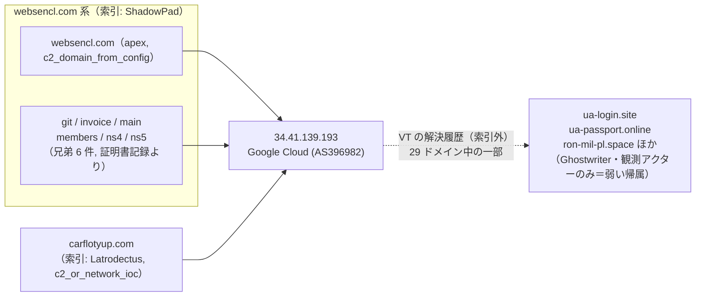
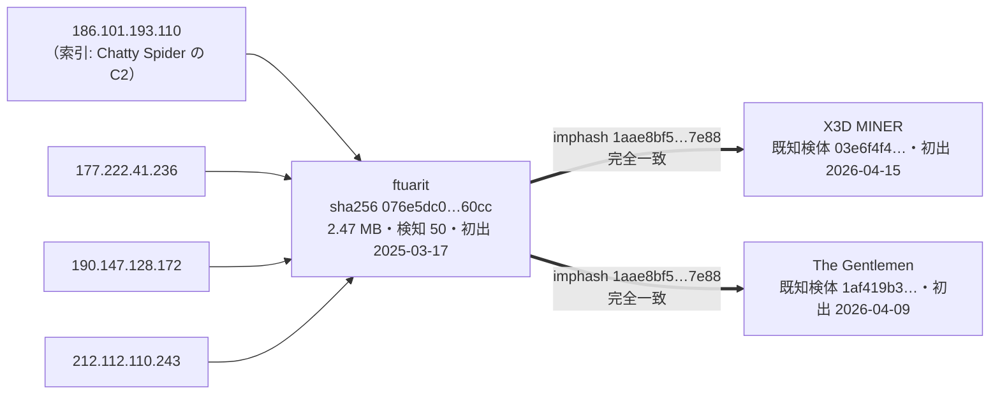

> **このレポートは AI（Claude）が自動生成したものです。人の確認を前提としてください。**

# 週次レポート 2026-W35（2026-08-23 〜 2026-08-29）

## 見つかったもの

### ドメインの生存と切り替わり

**証明書の記録から出た兄弟が、`asecdns.com`（Laundry Bear / OWAReaper の DNS 系外送）の運用規模を明らかにした。**
索引は `asecdns.com` `dnsrecursive.eu` `tdndns.com` の 3 ドメインを既に同一記事（`article:20260731#5`）から
`Laundry Bear` に `attrs.アクター`（強い帰属）で結んでいたが、apex 単体しか持っていなかった。今回の兄弟収集で
`dns` `doh` `dot` `india` `website` `www.dns` `www.doh` `www.dot` の 8 件が新たに出て
（`asecdns.com` 系兄弟 8 / 190 件）、全件が単一 IP **`146.70.81.56`**（M247 Europe SRL, AS9009）に解決している。DoH/DoT を騙る名前が揃っており、
`dns_fallback_exfiltration` の役割そのままの運用基盤とみてよい。

**`kesmn.com`・`eclipse.garden`・`zjcounty.com` が今週の上位変化。** `kesmn.com`（`c2_or_infrastructure_as_record`）は
08-28 に `46.151.182.181 → 217.60.195.82`（SWISSNET LLC, AS209373）へ IP 変更。`eclipse.garden`（`c2`）は
08-24 に自前ホスティング（AS219502）から Cloudflare（AS13335）へ移動し、CDN 化した。`zjcounty.com`
（`C2/通信` `payload_distribution_host`）は 08-23 に一度落ち、08-24 に索引未収載の IP `156.250.85.200` で復活し、
索引に無い検体 1 件（`157dcb52…674.ps1`、検知 8、初出 2026-07-19）が付いた。この IP はまだ経路表にもエンリッチにも
無く、次のピボットの入り口になりうる（詳細は「そこから得られそうなもの」）。

**`carflotyup.com`（Latrodectus）と `websencl.com`（ShadowPad）が、同じ GCP の 1 台に同居した。** 詳細は
「つながったもの」参照。

**`tirakian.com`（`c2_or_network_ioc`）が 08-25 に nxdomain 化。** 兄弟は無く、単独ドメインの失効。

**証明書記録の apex が新しく 1 件、共用基盤と判定された。** `chickenkiller.com`（今回 37,211 ホスト、
閾値 200 を大きく超過）で、索引はこの apex を配下の C2 として持っていた
（`gfsg.chickenkiller.com` = ShadowPad 設定通信、`hdrgdrfes.chickenkiller.com` = C2、いずれも `ai-security-analysis`
由来）。動的 DNS 事業者の apex と判明したので、この 2 ドメインの生死は個別ホストとしてではなく「その事業者の
契約者の入れ替わり」として読む必要がある（詳細は最後の報告事項）。

## つながったもの

### `carflotyup.com`（Latrodectus）と `websencl.com`（ShadowPad）が同一 GCP インスタンスに同居した

`websencl.com` apex と兄弟 6 件（`git` `invoice` `main` `members` `ns4` `ns5`、証明書記録より新規）、
そして別系統の索引ドメイン `carflotyup.com` が、**まったく同じ 1 個の IP `34.41.139.193`**（IPv6 も
`2600:1900:4001:96e:8000:1:291:4da2` で一致）に解決している。この IP は索引の `iocs.jsonl` には無いが、
VT の DNS 解決履歴からは他に 29 ドメインが同じ IP を経由したと分かり、その中には `ua-login.site`
`ua-passport.online`（ウクライナのパスポート申請を騙る）`ron-mil-pl.space`（ポーランド軍を騙る）
`wp-pl-potwierdz-dostep.site`（ポーランド語「アクセス確認」）が含まれる。これらは索引側で `Ghostwriter`
に結ばれているが、関係語が `観測アクター`（役割を述べない弱い言及、記事に一緒に出ただけの可能性）なので、
**Ghostwriter 帰属は仮説にとどめる**。

**GCP は巨大 AS（AS 単体では根拠にならない）だが、ここでの一致は「同じ AS」ではなく「同じ 1 個の IP」**
なので、相乗りホスティングの誤検知とは性質が違う。一方、Latrodectus（ローダー）と ShadowPad（APT 系
バックドア）は本来別系統のマルウェアで、索引側にはどちらの case にもアクター帰属が無い
（`case.ファミリ` のみ）。**同一運用者が両方を回している可能性と、単に同じ貸し出しホストを別々の借り手が
使っている可能性の両方が残る**（マルウェア系統が異なる以上、後者もあり得る）。

### Chatty Spider の検体 1 件が、4 つの IP を経由して X3D MINER・The Gentlemen の既知検体と imphash で一致した

ピボットで拾った検体は 1 個（`ftuarit`、sha256 `076e5dc0…960cc`）で、**4 つの異なる IP と通信していた**
ことが `communicating_files` から分かった。うち `186.101.193.110` は索引が `Chatty Spider` の C2 として
持つ IP。この検体の imphash が、同じ IP に紐づく `X3D MINER`・`The Gentlemen` の既知検体（互いに別サンプル、
初出 4 月）と完全一致する。単一の名前・単一のサイズ（1 検体を 4 IP から見ているだけ）なので汎用スタブの
兆候ではない。ただし **X3D MINER と The Gentlemen の既知検体どうしも同じ imphash を共有しており**
（索引側で既に同じ値を持つ）、この imphash 自体がこの界隈で複数アクターに再利用されている可能性は残る
（`value_spread`: 2 アクター / 9 IOC、ファンアウト上限 5 の範囲内）。**妥当だが単独では弱く、Chatty Spider と
X3D MINER / The Gentlemen が同一という結論にはまだ足りない。**

## そこから得られそうなもの

- **`34.41.139.193` の残り約 29 ドメイン（`ua-login.site` `ron-mil-pl.space` ほか）を洗う。** Ghostwriter は
  `観測アクター`（弱い言及）でしか結ばれていないため、この IP を種にした次のピボットで役割の濃い IOC が
  出れば帰属の白黒がつく
- **`zjcounty.com` の新しい解決先 `156.250.85.200` を追う。** 経路表・エンリッチのどちらにも無い IP で、
  索引外の検体も 1 件付いている。次回の fetch-asn / enrich-intel で AS が付けば、他の `payload_distribution_host`
  との相乗りが見えるかもしれない
- **`Myxa VPN ↔ TA4922`（imphash `dcaf48c1…50ed`）に新しいピボット検体 `jqu5zj.exe`（13.72 MB・検知 9、
  2026-06-01）が付いた。** 先週の `loader.exe`（8.4 MB）と合わせて 2 検体目のピボット結果になるが、
  依然 n=2 で判断材料が足りない
- **`UNK_DeadDrop ↔ Webworm`（vhash `017086655d55551d15…`）は先週と同じサイズ帯（11.46〜14.29 MB）・
  同じ偽装名（`google-update-support-windows-amd64.exe`）で再検出された。** 汎用スタブの兆候（桁違いの
  サイズ差）は無く、先週の「妥当だが未確定」判断は据え置きでよい

## 疑い

- **imphash `88016fcdef7f227c62…`（`PhantomEnigma ↔ Rognar` が新規、`PhantomEnigma ↔ Transparent Tribe` は
  既知）への疑いを継続・補強する。** 今回のピボットで拾えたのは 8 検体・全て `Win32 EXE`・サイズ
  **56.57〜56.58 MB（比 1.0 倍）** で、先週報告した「105 検体・名前 74 種・2.34〜56.6 MB（24 倍）」とは
  まるで違う母集団が出た（写しは週ごとに引き直しており累積しないため、毎週別の断面を見ている）。
  **同じ imphash が観測のたびに大きさもまとまりも違う集団を返すこと自体が、値が広く使い回されている
  ことの傍証**であり、疑いは晴れていない。新規の `PhantomEnigma ↔ Rognar` エッジもこの imphash 経由なので、
  確定した関係としては扱わない
- **vhash `056056655d15756az459z6tz`（`SMOKE#SCREEN ↔ Storm-2949`、新規）は n=1 で、しかもファイル名が
  `ScreenConnect.ClientSetup.exe`——正規リモート管理ツールのインストーラそのもの。** RMM ツールの使い回しは
  複数の無関係なアクターで起きるため、vhash 一致だけでは正規インストーラの構造一致（バイナリ配布元が
  同じだけ）の可能性を排除できない。**この橋は却下が妥当**
- **imphash `c2d457ad8ac36fc9f1…`（`Storm-2949 ↔ The Gentlemen`）は先週指摘した Go バイナリの
  imphash 衝突を再確認した。** 今回のピボット検体は実在の OSS ツール `tor-relay-scanner-go-windows-amd64.exe`
  （sha256 一致、6,555,648 byte、初出 2024-10-30）そのもので、先週と同一の検体が再度拾われている。
  **却下を維持**
- **imphash `4e2bd2c481372f7ab1…`（`APT29 sub-cluster` `Rognar` `UNC7005` ↔ `ShinyHunters`）は
  先週確認済みの CornFlake / DOUBLECUP の橋と同一の 2 検体（6.10 MB・6.11 MB、05-28/05-29 初出）で、
  新しい証拠は無い。** 進展なし
- **imphash `948cc502fe9226992d…`（`APT37 ↔ Chatty Spider` / `APT37 ↔ Myxa VPN`）は先週指摘した
  「片方の検体名がサンドボックスの複合タグ」の問題が今回も解消していない。** 判断材料としては使えないまま
- **`Silver Fox ↔ SilverFox APT`（vhash、根拠 144 件・77 IOC）は先週と完全に同じ値（`value_spread` も
  77 IOC で一致）。** 名寄せ漏れの追認が続いているだけで、新しい進展ではない
- **`KongTuke ↔ Qilin` / `KongTuke ↔ TAG-195`（vhash `c0898bab35bfdb4cf7…`）は依然 2 検体
  （`go123151r.exe` / `yentk6l1.exe`、いずれも 49,152 byte・同一サイズ）のまま。** 先週から進展なし。
  人の確認待ちを継続
- **`毎日組` 113 件は、切り替わりではなく構成としてそのまま扱う。** `app.business-data-leaks.com` /
  `app.ep6pheij.com`（7 日）は先週までの一族の継続。今週は加えて、証明書記録の兄弟 79 件を持つ
  `iuqerfsodp9ifjaposdfjhgosurijfaewrwergwff.com` 系が丸ごと毎日組に入った——2 個の IP
  （`216.245.197.45` 62 件 / `77.247.179.87` 17 件）の範囲内で毎日入れ替わる構成で、個別の切り替わりとしては
  読めない
