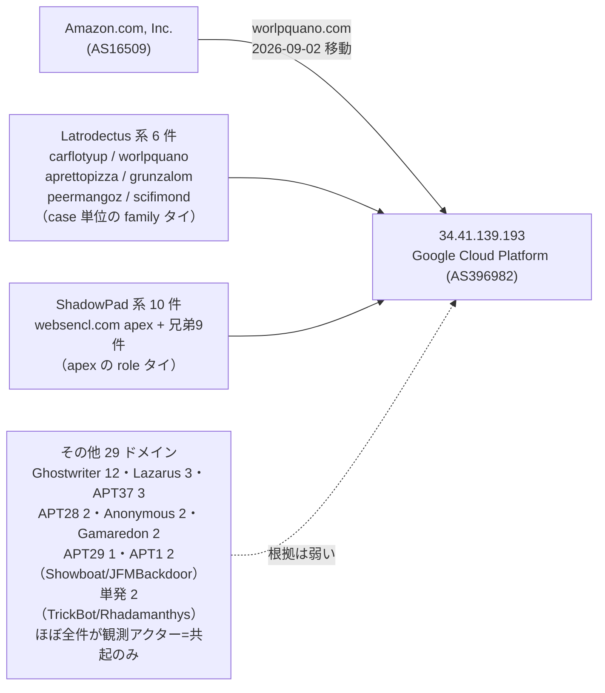

> **このレポートは AI（Claude）が自動生成したものです。人の確認を前提としてください。**

# 週次レポート 2026-W36（2026-08-29 〜 2026-09-05）

## 見つかったもの

### ドメインの生存と切り替わり

**`worlpquano.com`（Latrodectus、`c2_or_network_ioc`）が 09-02 に Amazon（AS16509）から
Google Cloud（AS396982）の `34.41.139.193` へ移動した。** この IP は先週の報告で
`websencl.com`（ShadowPad）系と `carflotyup.com`（Latrodectus）の同居先として既に
挙げていたもので、`worlpquano.com` はそこに合流した形になる。今回、この IP に固まっている
全ドメインを洗い直したところ、想定より遥かに大きな共有ノードだったことが分かった。
詳細は「つながったもの」参照。

**`zjcounty.com`（`payload_distribution_host`）が 09-03 に `156.250.85.200 → 156.250.73.75`
へ IP 変更。** 両方とも同じ `156.250.64.0/18`（AS142286, LUOGELANG (FRANCE) LIMITED,
香港）に属し、事業者そのものは変わっていない。このブロックは経路表には乗っているが
索引・エンリッチのどちらにも AS として登場せず、依然として未収載のまま。付いている
索引外の検体（`157dcb521adc7226…3c723b.ps1`、検知 8、初出 2026-07-19）も先週報告した
ものと**同一 sha256**で、新しい検体ではない。詳細は「そこから得られそうなもの」参照。

**`rpc-cloud.beer`（`dynamically_resolved_api`）が 09-04 に nxdomain 化。** 兄弟は無く、
単独ドメインの失効。

**証明書記録の再収集は、共用基盤・新規 apex ともに先週から変化なし。** 111 apex を
再取得し、`dropboxusercontent.com`（148,323）`42web.io`（46,092）`chickenkiller.com`
（37,716）`ydns.eu`（11,201）`4nmn.com`（8,487）`cpolar.top`（555）の 6 apex は
引き続き共用基盤として中身を採らず、新しく共用基盤と判定された apex は無かった。
兄弟の内訳も `magsa.com.pe`（Agent Tesla, `c2_or_network_ioc`）に
`api.ubigeo.magsa.com.pe` `www.api.ubigeo.magsa.com.pe` の 2 件が増えた以外は
先週と完全に同じ 190 件のまま（今回の合計は 192 件）。新しい 2 件も既存の兄弟と
同じ IP `192.185.37.239`（Network Solutions, LLC）に解決しており、固まりを崩していない。

## つながったもの

### `34.41.139.193`（Google Cloud）が、想定の 3 倍以上の規模を持つ共有ノードだった

`worlpquano.com` の移動をきっかけに、この IP に解決する全ドメインを `state.jsonl` で
洗い直したところ、**45 ドメイン**が現在ここに集まっていることが分かった。役割の
固有性で 3 層に分かれる。

**固有性が高いのは 2 群。** `Latrodectus` 系 6 件（`carflotyup.com` `worlpquano.com`
`aprettopizza.world` `grunzalom.fun` `peermangoz.me` `scifimond.com`）は、それぞれ**別々の
case ID**からファミリへ辿り着いており（単一記事の使い回しではない）、`ShadowPad` 系
10 件は `websencl.com` apex の role がそのまま crtname の兄弟 9 件に及んでいる。
**この 2 群だけを見れば「同一運用者、または同一の貸し出し元を複数の攻撃者が使っている」
という仮説は妥当**（case/apex 単位のタイなので `family` や `観測アクター`より固有性が高い）。

**一方、残り 29 ドメインは観測アクター（記事への共起のみ）または単発の attrs. タイで、
Ghostwriter・Lazarus・APT37・APT28・Anonymous・Gamaredon・APT29・APT1 と実に 8 系統に
散っている。** これだけ性質の異なる攻撃者・マルウェアが 1 個の IP に同時に載っている
ことは、**個々の役割タイの強さに関わらず、このノードそのものが単一運用者の専有基盤
ではなく複数の借り手が使う共有・貸し出し型ホストである可能性を強く示す**（弱い仮説では
なく、むしろこちらのほうが自然な読み）。したがって `Ghostwriter` を含むこの 29 件を
「Latrodectus / ShadowPad と同一勢力」と読むのは誤りで、先週保留とした
`Ghostwriter` 帰属（観測アクターのみ）も引き続き仮説にとどめる。**IP の一致だけでは
アクター間の関係を主張しない。**

## そこから得られそうなもの

- **`zjcounty.com` の新しい所在地 AS142286（LUOGELANG (FRANCE) LIMITED, 香港、
  `156.250.64.0/18` 16,384 アドレス、AS 全体で 25 prefix / 133,888 アドレス）は、
  索引にも `asns.jsonl` にも一切登場しない。** 現状ここに乗っている追跡対象は
  `zjcounty.com` 1 件だけだが、未収載のブロックなので次回のピボット・スキャン先の
  候補として残しておく価値がある（妥当）
- **`34.41.139.193` の「その他 29 ドメイン」は、いずれも索引に役割を持ちながら
  個別にピボットされたことがない。** 特に `westurn.in`（TrickBot、attrs.マルウェア）・
  `kaztelecom.shop`（APT1 / Showboat）・`singtelcom.site`（APT1 / JFMBackdoor）・
  `8nioqhxciwoqc.click`（Rhadamanthys）は観測アクターより強い attrs. 系のタイを
  持っており、次回の `fetch-pivot.mjs` の的に加える候補になる
- **`zjcounty.com` の索引外検体（`157dcb521adc7226…3c723b.ps1`、検知 8）は先週から
  同一のまま増えていない。** 新規性は無いが、`payload_distribution_host` の役割と
  整合する挙動が 2 週連続で観測されている

## 疑い

**今週のピボットは、実質的に新しい橋を 0 件しか出さなかった。** `fetch-pivot.mjs
--targets 150` で IP 120 / ドメイン 30 を新たに引き、索引に無い検体 2,520 件を
回収したが、ガードを通った 19 組のうち **18 組は先週と sha256 が完全に一致する
検体の再検出**で、`support` 件数・`value_spread`（IOC 数・アクター数）も先週と
1 件残らず同じだった。個別の再確認は以下のとおり、判断はすべて先週から据え置き。

| 組 | 値 | value_spread | 今週確認した中身 | 判断 |
| --- | --- | --- | --- | --- |
| Silver Fox ↔ SilverFox APT | vhash | 77 IOC / 2 アクター | `QQHong_*` 系 ZIP、108〜368 MB に散る | 却下維持（配布基盤の汎用スタブ） |
| PhantomEnigma ↔ Transparent Tribe / Rognar | imphash | 17 IOC / 3 アクター | ピボット 8 検体、全 Win32 EXE・56.57〜56.58 MB（比 1.0 倍） | 未確定のまま据え置き |
| Chatty Spider ↔ X3D MINER / The Gentlemen | imphash | 9 IOC / 2 アクター | 単一検体 `ftuarit`（sha256 076e5dc0…960cc、先週と同一） | 妥当だが単独では弱いまま |
| SMOKE#SCREEN ↔ Storm-2949 | vhash | 3 IOC / 1 アクター | `ScreenConnect.ClientSetup.exe`（先週と同一ファイル名） | 却下維持 |
| KongTuke ↔ Qilin / TAG-195 | vhash | 5 IOC / 1 アクター | `go123151r.exe` / `yentk6l1.exe`、いずれも 49,152 byte（先週と同一） | 進展なし |
| UNK_DeadDrop ↔ Webworm / Transparent Tribe | vhash | 5 IOC / 2 アクター | `google-update-support-windows-amd64.exe` 11.46 MB・別検体 14.29 MB（先週と同一サイズ帯） | 未確定のまま据え置き |
| APT29 sub-cluster / Rognar ↔ ShinyHunters / UNC7005 | imphash | 4 IOC / 3 アクター | 6.10 MB・6.11 MB の同一 2 検体（05-28/05-29 初出、先週と同一） | 進展なし |
| Storm-2949 ↔ The Gentlemen | imphash | 3 IOC / 3 アクター | `tor-relay-scanner-go-windows-amd64.exe`（実在 OSS、先週と同一） | 却下維持 |
| APT37 ↔ Chatty Spider / Myxa VPN | imphash | 4 IOC / 1 アクター | 複合タグ検体 + `Feb Order#008542Z.exe`（新しい検体名だが判断材料にならない点は変わらず） | 判断不能のまま |

**唯一の新規は `Gambling Goblin ↔ Myxa VPN`（vhash `e840a106…`、`value_spread` 5 IOC /
1 アクター）だが、既に索引の `overlaps.jsonl` にある JARM のみの弱い組（strength 1、
`weak_only`）への傍証にすぎない。** しかも同じ vhash を持つ索引側の検体の 1 つは
`rclone`（ELF、検知 **0** の正規ツール）で、悪性判定の付いた検体（`esxi` `d7s5f2.exe` など）
と無害な正規バイナリが同じ構造ハッシュを共有している。**これは vhash 自体が
汎用的な ELF リンカ構造の産物である可能性を示しており、疑いはむしろ強まった**
（弱いまま・却下が妥当）。

**`毎日組` は今週も 113 件で、先週と件数が完全に一致する。** `iuqerfsodp9…wergwff.com`
系（WannaCry のキルスイッチとして知られる sinkhole ドメイン、証明書記録の兄弟 79 件）と
`app.business-data-leaks.com` / `app.ep6pheij.com` の一族が主体で、いずれも先週から
続く構成のままであり、切り替わりとしては読まない。
