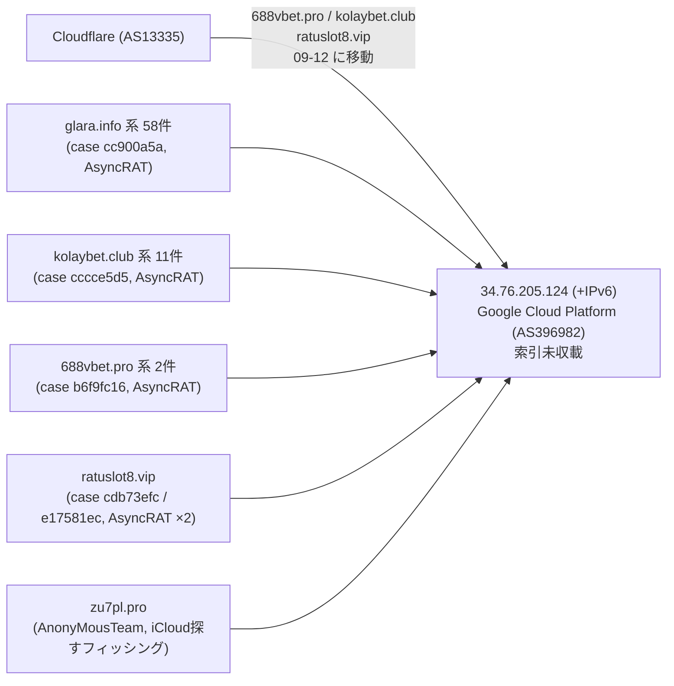

> **このレポートは AI（Claude）が自動生成したものです。人の確認を前提としてください。**

# 週次レポート 2026-W37（2026-09-06 〜 2026-09-12）

## 見つかったもの

### ドメインの生存と切り替わり

**`688vbet.pro` `kolaybet.club` `ratuslot8.vip`（いずれも `configured_c2`、AsyncRAT の案件）が
09-12 に揃って Cloudflare（AS13335）から Google Cloud Platform（AS396982）へ移動し、
`glara.info` 系がすでに固まっていた `34.76.205.124` に合流した。** 3 ドメインとも `www` 付きを含め
同日・同じ移動で、CDN の裏に隠れていた実体が同じ IP に露出した形になる。詳細は「つながったもの」参照。

**`saicetyapy.space`（Latrodectus、`c2_or_network_ioc`）が 09-07 に nxdomain 化。**
兄弟は無く、単独ドメインの失効。

**`clipmagic.co`（`configured_c2`）は 09-09 に nxdomain 化した。** 上記 3 ドメインと同じ週に
新規収集された、賭博サイトを騙る名前の C2 バッチの一つで、こちらは早々に落ちている。

**証明書記録の再収集で、役割つき apex が 111 → 122 に増え、新しく共用基盤と判定された
apex が 1 件出た。** `netcup.net`（31,274 件、ドイツの VPS 事業者 netcup GmbH の既定ホスト名
`hostingNNNNN.<顧客ID>.netcup.net`）で、きっかけは今週の新規 IOC
`hosting237141.af91b.netcup.net`（Snake Keylogger / VIPKeyLogger、侵害された WordPress の
`/wp-includes/sitemaps/.../crypted.ps1` に検体を置く `payload_staging`）。**索引はこの
netcup.net 配下を攻撃者ドメインとして持っていたが、実態は顧客が侵害された共用 VPS ホスティングで、
兄弟は他人のもの。** 中身は採らずメタに残した。共用基盤は他に
`dropboxusercontent.com`（148,327）`42web.io`（46,192）`chickenkiller.com`（38,210）
`ydns.eu`（11,211）`4nmn.com`（8,488）`cpolar.top`（555）の 6 apex で、いずれも先週から
継続（新規ではない）。追う価値のある兄弟は 192 → 201 件（新規 9 件はすべて `kolaybet.club`
配下の `admin` `api` `app` `apps` `backend` `cdn` `dev` `staging` `test`）。

## つながったもの

### `34.76.205.124`（Google Cloud）が、独立した 4 件の AsyncRAT 案件 + 無関係なフィッシング 1 件を同居させていた

先週すでに `glara.info` の兄弟 57 件がこの IP（および IPv6 `2600:1901:0:51b9::`）に固まっている
ことは分かっていたが、今週 `state.jsonl` を洗い直すと、**独立した案件（`case:`）が新たに 4 件
（3 つの新しいドメイン系統にまたがる）合流していた**ことが判明した。索引の記事はこの IP 自体を
一度も挙げていない。

**内訳は合計 73 ホスト・案件（`case:`）ベースで 5 件。** `glara.info`（58 ホスト）
`kolaybet.club`（11）`688vbet.pro`（2）`ratuslot8.vip`（1、案件 2 件のタイ）はいずれも
`configured_c2` で AsyncRAT の設定済み C2 だが、**案件 ID がすべて別々**（同一の設定抽出の
使い回しではない）。加えて `zu7pl.pro`（`AnonyMousTeam` の iCloud「探す」機能フィッシング
キット、証明書 SAN 53 件）という**テーマの異なる案件も同じ IP に同居**している。

**もっとも妥当な読みは、この IP が単一の攻撃者の専有基盤ではなく、複数の AsyncRAT 運用者が
乗る貸し出し型ノード（あるいは同一の設定・配布ツールキットの再販元）だという仮説。**
案件 ID がすべて異なる以上「同一犯」とは主張できないが、**独立した 4 件の AsyncRAT 案件が
1 個の IP に集まり、しかもそのうち 3 件が今週まさに Cloudflare の裏から出てきて合流した**
という動きそのものが、単なる偶然の同居より強い証拠になっている（妥当）。AS396982 自体は
5,146 万アドレスの大規模事業者なので、AS が同じというだけでは何も言えない点は変わらない。

## そこから得られそうなもの

- **`34.76.205.124`（および対応 IPv6）は索引にもエンリッチの `asns.jsonl` にも「役割」としては
  登場せず、`fetch-pivot.mjs` の的の条件（役割の主張）を満たさないため対象外のまま。**
  4 件の AsyncRAT 案件が集まった以上、次回はこの IP を手動の的に加える価値がある（妥当）
- **`api.wirevpn.app`（`Lurking Lizard`、`proxyware` に `attrs.マルウェア`）に索引外の検体が
  28 件付いたまま。** APK 版に `FreeYouTubeDownload` 等の無関係ブランドの改変配布物が
  混ざる。次のピボット候補
- **`pool.supportxmr.com`（XMRig、`X3D MINER` に `attrs.アクター`）に索引外の検体が 120 件。**
  ただし実在の公開マイニングプール（多数の無関係なクリプトジャッキングが同じプールを使う）
  のため、120 件をそのまま `X3D MINER` の規模と読むのは誤り（弱い）。`X3D MINER` は下記
  「疑い」の `Chatty Spider ↔ X3D MINER` 橋にも登場するアクターで、関連は別経路でも出ている
- **`3w.jxuw3.com`（`Silver Fox`、`ValleyRAT`）に索引外の検体 40 件、`eastmedia3347.co.cc`
  （`Transparent Tribe`、観測アクターのみで弱い）に 56 件。** いずれも先週から継続、
  `3w.jxuw3.com` は毎日組の一員のため単独のシグナルとしては弱いまま

## 疑い

**今週のピボットはガードを通った組が 19 → 40（値ベースで 25 種）に増えたが、増えた分の多くは
「もっと調べたら疑わしくなった」側だった。** `fetch-pivot.mjs --targets 150` を 2 回（IP 240 /
ドメイン 60）実行し、索引に無い検体を計 4,193 件回収、写し 600 件を照合した。

**`PhantomEnigma ↔ Rognar / Transparent Tribe`（imphash）が、先週は「narrow band」に見えていたが
的を増やしたら評価が反転した。** 先週時点では 8 検体・全 Win32 EXE・56.57〜56.58 MB という
狭い帯に見え「未確定のまま据え置き」としていたが、今週この imphash を新しい的（91.92.240.100
ほか）から洗い直すと **112 検体・別名 86 種（77%）・サイズ 2.34〜90.90 MB（39 倍）** まで
裾野が広がった。ガード 5（`件数 20 以上 かつ 別名比 0.8 以上`）の 0.8 にわずかに届かず自動では
落ちないが、**この広がり方は配布基盤の汎用スタブの型そのもの**であり、先週の判断を
「妥当」から「却下が妥当」へ改める。

**`Armored Likho ↔ Silver Fox`（imphash、索引に既存の組）も同じ型。** 9 検体・別名 7 種・
サイズ 150 KB〜368 MB（2,453 倍）で、値の広がりだけでは判別できない極端な例。

**`Inception ↔ SMOKE#SCREEN`（vhash、新規）は `ScreenConnect.ClientSetup.msi` が 34 検体中
10 件を占め、他も `SystemCheck.msi` `DocumentReview.msi` など汎用インストーラ名ばかりだった。**
先週 `SMOKE#SCREEN ↔ Storm-2949` で却下した「実在の RMM ツールの構造ハッシュが無関係な脅威と
結び付くだけ」という読みが、**別の vhash・別の相手でもう一度再現**しており、`SMOKE#SCREEN`
という組み手自体が ScreenConnect 悪用の構造的な誤検出源になっている疑いが強まった。

主な組の再確認は以下のとおり（40 組中、支持件数の大きい順。値ベースで集約）。

| 組 | 値 | value_spread | 今週確認した中身 | 判断 |
| --- | --- | --- | --- | --- |
| PhantomEnigma / Rognar ↔ Transparent Tribe | imphash | 117 IOC / 3 アクター | 112 検体・別名 86 種・2.34〜90.90 MB | 却下が妥当（先週から反転） |
| Silver Fox ↔ SilverFox APT | vhash | 78 IOC / 2 アクター | 76 検体、`QQHong_*` 系 ZIP 9 種、108〜159 MB | 却下維持（配布基盤の汎用スタブ） |
| APT29 / APT29 sub-cluster ↔ UNC7005 | vhash | 7 IOC / 2 アクター（索引既知） | 7 検体・別名 4 種、`vendor-9f3a1c.min.js` 等、56〜59 KB の狭い帯 | 妥当（正規JSを装う小型クラスタ）だが単独では弱い |
| Chatty Spider ↔ X3D MINER / The Gentlemen | imphash | 9 IOC / 2 アクター | 単一検体 `ftuarit`（先週と同一） | 妥当だが単独では弱いまま |
| SMOKE#SCREEN ↔ Storm-2949 | vhash | 4 IOC / 1 アクター | `ScreenConnect.ClientSetup.exe`（先週と同一） | 却下維持 |
| Silver Fox ↔ TA4922 | vhash | 1 IOC / 2 アクター（索引既知） | 単一 ZIP 372 KB、根拠 1 件のみ | 材料不足 |
| Armored Likho ↔ Silver Fox | imphash | 9 IOC / 1 アクター（索引既知） | 9 検体・別名 7 種、150 KB〜368 MB | 却下が妥当（極端な広がり） |
| APT29 sub-cluster / Rognar ↔ UNC6240 / UNC7005 | imphash | 4 IOC / 3 アクター（索引既知） | 7 検体・別名 3 種、6.10〜20.22 MB | 進展あり、様子見 |
| Inception ↔ SMOKE#SCREEN | vhash | 21 IOC / 1 アクター | 34 検体、`ScreenConnect.ClientSetup.msi` 等の汎用 MSI 名 | 却下が妥当（正規ツール悪用の構造誤検出） |
| KongTuke ↔ Qilin / TAG-195 / The Gentlemen | vhash | 8 IOC / 1 アクター（索引既知） | 5 検体・別名 5 種、26〜49 KB の極小インストーラ | 進展なし |
| UNC5174 ↔ UNK_MassTraction | vhash | 3 IOC / 1 アクター | 単一 ELF 9,848 byte ×2 | 材料不足 |
| Transparent Tribe / UNK_DeadDrop ↔ Webworm | vhash | 5 IOC / 2 アクター | 11.46 MB・14.29 MB（先週と同一） | 未確定のまま据え置き |
| APT37 ↔ Chatty Spider / Myxa VPN | imphash | 4 IOC / 1 アクター | 961 KB・1.21 MB（先週と同一） | 判断不能のまま |
| Chatty Spider ↔ GreyVibe | imphash | 5 IOC / 1 アクター | 341〜820 KB、根拠 2 件 | 材料不足で判断保留 |
| Head Mare ↔ Silver Fox / UTG-Q-1000 | vhash | 2 IOC / 1 アクター | 単一 199.4 MB Win32 EXE | 材料不足 |
| Inception ↔ Sandworm Team | vhash | 4 IOC / 1 アクター（索引既知） | 4 検体・別名 3 種、ELF 66〜120 KB | 弱いが妥当な範囲 |
| Myxa VPN / SMOKE#SCREEN ↔ TA4922 | imphash | 7 IOC / 1 アクター | 8.40 MB・13.72 MB | 材料不足 |
| PhantomEnigma ↔ Silver Fox | imphash | 5 IOC / 1 アクター（索引既知） | 4 検体・別名 3 種、449 KB〜5.74 MB | 弱いまま |
| REF8372 ↔ X3D MINER | imphash | 16 IOC / 1 アクター | 17 検体・別名 11 種、`Installer.exe`/`Loader.exe` 等、2.20〜2.64 MB の狭い帯 | 汎用ローダ疑いだが帯は狭く要観察 |
| Gambling Goblin ↔ Myxa VPN | vhash | 5 IOC / 1 アクター（索引既知） | `d7s5f2.exe`（先週と同一、`rclone` と構造ハッシュ共有） | 弱いまま・却下が妥当 |
| Storm-2949 ↔ The Gentlemen | imphash | 7 IOC / 3 アクター | 6 検体・別名 6 種、`tor-relay-scanner`（実在 OSS）中心 | 却下維持 |

**その他（`Silver Fox↔Transparent Tribe` `China-nexus actor↔Silver Fox` `Gambling Goblin↔Inception`
`Head Mare↔Transparent Tribe`）は根拠 1〜2 件・検体 1〜4 個の最小構成で、個別の判断には
まだ材料が足りない。**

**「毎日組」は 105 件（観測日は今週から欠測なく 7 日連続）。** `iuqerfsodp9…wergwff.com` 系
（WannaCry のキルスイッチとして知られる sinkhole ドメイン）と `gist.github.com`
（`dead_drop_configuration`、GitHub 公式サービス）が主体で、いずれも「そういう構成」として
継続。`business-data-leaks.com` / `ep6pheij.com` 系は今週の欠測観測日の谷間で個別の
AS 一覧が引けなかった日があり、正確な比較は次週に持ち越す。

**`oidng2.duoshit.com`（ValleyRAT、`c2_or_infrastructure_as_recorded`）が 09-07 と 09-12 に
同じ 2 つの IP（`VH Global Limited`）を往復した。** 移動ではなく往復のため、切り替わりとしては
読まない。
