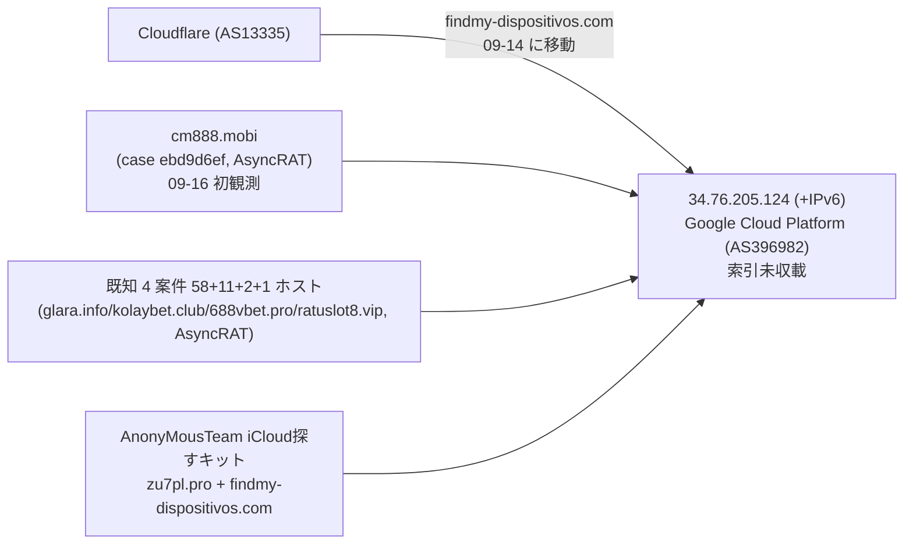
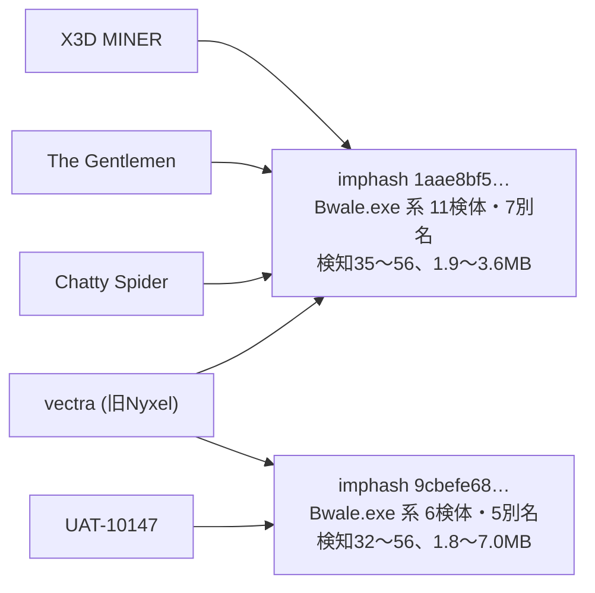

> **このレポートは AI（Claude）が自動生成したものです。人の確認を前提としてください。**

# 週次レポート 2026-W38（2026-09-12 〜 2026-09-19）

## 見つかったもの

### ドメインの生存と切り替わり

**`cm888.mobi`（AsyncRAT、新規 case `ebd9d6ef…`、初観測 09-16）と `findmy-dispositivos.com`
（`AnonyMousTeam` の iCloud「探す」フィッシングキット、09-14 に Cloudflare → Google Cloud へ移動）が、
先週報告した共有ノード `34.76.205.124`（+ IPv6 `2600:1901:0:51b9::`）に合流した。** 案件（`case:`／
記事）ベースで 5 件 → 6 件、ホスト数 73 → 76 に増えている。`findmy-dispositivos.com` は
`zu7pl.pro` と同じ記事（`article:20260826#0`）由来で新規案件ではなく、既知のフィッシングキットの
2 本目のドメインとして同じ IP に着地した形。`cm888.mobi` は独立した AsyncRAT の新しい `case` で、
このノードでは初めて見る案件 ID。詳細は「つながったもの」参照。

**証明書記録の再収集で、役割つき apex が 122 → 132（+10）、追う価値のある兄弟が 201 → 240
（+39）に増えた。共用基盤の判定は先週と同じ 7 apex で、新規判定は無し**
（`dropboxusercontent.com` `42web.io` `chickenkiller.com` `netcup.net` `ydns.eu` `4nmn.com`
`cpolar.top`）。新規 apex のうち目立つのは 2 件。

- **`szpd.info`（AsyncRAT、`configured_c2`、新規 case `633ebe09…`）の兄弟 11 件が全件
  `208.91.197.39`（Confluence Networks Inc、AS40034、**索引に無い**）に固まった。**
  索引はこのドメインの apex しか持っていなかったが、`admin` `api` `app` `backend` `dev` `remote`
  `shop` `staging` `test` など 11 件の兄弟が同じ IP に着地しており、新しい足場と見てよい（妥当）
- **`asecdns.com`（`Laundry Bear` / `OWAReaper`、`dns_fallback_exfiltration`）の兄弟 8 件が
  全件 `146.70.81.56`（M247 Europe SRL）に固まり、同じ記事（`article:20260731#5`）由来の
  既存の索引ドメイン `dnsrecursive.eu` `tdndns.com` と同居していた。** これは新しいアクター間の
  つながりではなく、**同一案件の別ドメインが同じ IP にあることの確認**（同じ事実の重複）

**`logs.uvexio.com`（PureLogs C2）が 09-15 に IP を変更したが、`state.jsonl` の `as_changes:0`
から前後とも同一 AS（`1337 Services GmbH`、AS210558）内の移動だと分かる。** ブレットプルーフ寄りの
1 ホスティング事業者内での IP ローテーションで、単独ドメインのため弱い。

**`nvms9000.online`（`secondary_shell` / `secondary_shell_candidate`）が 09-19 に nxdomain 化。**
**`www.688vbet.pro` が 09-18 に no_answer 化した**が、apex `688vbet.pro` と `kolaybet.club` 系は
引き続き `34.76.205.124` で生存しており、上記の共有ノードとは別の弱い変化。

判定保留は 134 / 7401（1.8%）で、5% を大きく下回る。

## つながったもの

### `34.76.205.124`（GCP）の共有ノードに新しい AsyncRAT 案件が合流した（先週報告の続報）

先週時点で「案件（`case:`）ベースで独立した 5 件が同居」と報告した同じ IP に、**今週さらに
1 件（`cm888.mobi`、AsyncRAT）が新規に合流した。** AS396982（Google Cloud Platform）自体は
5,146 万アドレスの大規模事業者なので AS が同じというだけでは何も言えない点は先週と変わらないが、
**同一の固定 IP に案件が積み増され続けている**という動きそのものは、単発の相乗りより強い
シグナルとして残る（妥当）。

### "Bwale" ローダの imphash が複数アクターを跨ぐ

**`X3D MINER ↔ vectra` `The Gentlemen ↔ vectra` `Chatty Spider ↔ X3D MINER`
`Chatty Spider ↔ The Gentlemen` `UAT-10147 ↔ vectra` の 5 組が、いずれも `Bwale.exe`
（大文字小文字違い含む）という同じファイル名を持つ検体を介して同じ imphash 系に集まった。**
先週 `Chatty Spider ↔ X3D MINER` を「単一検体 `ftuarit`、単独では弱い」として据え置いていたが、
今回 `fetch-pivot.mjs` の的を広げたところ同じ imphash に `ftuarit` を含む 11 検体が見つかり、
**全て Win32 EXE・検知 35〜56（低くない）・サイズ 1.86〜3.62 MB（1.9 倍、狭い帯）**という
一貫した像になった。別の imphash（`9cbefe68…`）でも同じ `Bwale.exe` 名の検体が出ており、
**ローダの構造が複数の亜種にまたがって安定している**。ガードは通っているが `value_spread`
は 19 IOC / 2 アクターで広すぎない。4 つの異なる実体名（`X3D MINER` `The Gentlemen`
`Chatty Spider` `vectra`）が同じローダを共有している以上、単一運用者の専有ではなく
**共有ローダ・共有ビルダーの可能性が高い**という読みが妥当（value_spread が狭いことも支持材料）。

## そこから得られそうなもの

- **`szpd.info` が固まった `208.91.197.39`（Confluence Networks、AS40034）は索引にも
  `ip-asn.jsonl` にも「役割」としては登場せず、`fetch-pivot.mjs` の的（役割の主張）を
  満たさないため対象外のまま。** 次回はこの IP を手動の的に加える価値がある（妥当）
- **`KongTuke ↔ Qilin` / `KongTuke ↔ TAG-195`（vhash、新規）** は根拠 4 件ずつだが、
  2 検体とも `Windows Installer`・**ちょうど 49,152 byte で完全一致**・検知 23〜24
  （`go123151r.exe` `yentk6l1.exe`、いずれも乱数風の名前）。件数は薄いが、汎用インストーラに
  ありがちな「実在ツール」の型ではなく作りが揃っているため次週の的候補（弱いが妥当）
- **`UNK_DeadDrop ↔ Webworm` / `Transparent Tribe ↔ UNK_DeadDrop`（vhash、新規）** は
  `google-update-support-windows-amd64.exe`（Google Update を騙る名前）と `uum8mx.exe` の
  2 検体・11.46 MB / 14.29 MB（1.2 倍）。3 アクターにまたがる点は次週さらに検体を増やして
  確認したい（材料不足だが妥当な範囲）
- 生存ドメインに付いた索引外の検体は `dl.dropboxusercontent.com`（120）
  `www.iuqerfsodp9…`（120、毎日組）`pool.supportxmr.com`（120、公開マイニングプール）
  `api.wirevpn.app`（28）`3w.jxuw3.com`（40、毎日組）と、いずれも先週から継続で大きな動きは無い

## 疑い

**今週のピボットはガードを通った組が 21 組（既知 3 / 新規 18）。** `fetch-pivot.mjs --targets 150`
を 1 回（IP 120 / ドメイン 30）実行し、索引に無い検体を計 2,804 件回収、写し 300 件を照合した。

**`APT37 ↔ Chatty Spider` / `APT37 ↔ Myxa VPN`（imphash、新規）は根拠となった検体の一方が
VT の自動命名で `elex_floxif_frostygoop_glassworm_hive_salatstealer_sliver` という
6 系統の脅威ラベルを一度に抱えていた。** FrostyGoop（ICS 向け）・Hive（ランサムウェア）・
Sliver（C2 フレームワーク）・SalatStealer（スティーラ）という**互いに無関係な系統が
1 検体に同時に付く**のは、ベンダー判定がバラついた汎用検体である型そのもの。
**却下が妥当**（新規の判断）。

**`Silver Fox ↔ SilverFox APT`（vhash）は先週と同じ判断を維持。** 74 検体・別名 8 種
（`QQHong_*` 系）・108〜159 MB（1.5 倍）で、先週の「配布基盤の汎用スタブ」という
判断は変わらない（却下維持）。

主な組の再確認は以下のとおり（21 組中、支持件数の大きい順。値ベースで集約）。

| 組 | 値 | value_spread | 今週確認した中身 | 判断 |
| --- | --- | --- | --- | --- |
| Silver Fox ↔ SilverFox APT | vhash | 77 IOC / 2 アクター | 74 検体・別名 8 種、`QQHong_*` 系 ZIP、108〜159 MB | 却下維持（配布基盤の汎用スタブ） |
| X3D MINER ↔ vectra | imphash | 19 IOC / 2 アクター | 11 検体・別名 7 種、`Bwale.exe` 系、1.86〜3.62 MB | 妥当（共有ローダの疑い、進展あり） |
| The Gentlemen ↔ vectra | imphash | 19 IOC / 2 アクター | 同上（同一 imphash） | 妥当（同上） |
| Chatty Spider ↔ X3D MINER | imphash | 19 IOC / 2 アクター | 同上、`ftuarit`（先週の単体検体を含む） | 妥当（先週の材料不足から進展） |
| SMOKE#SCREEN ↔ Storm-2949 | vhash | 3 IOC / 1 アクター | `ScreenConnect.ClientSetup.exe`（実在 RMM） | 却下維持 |
| Chatty Spider ↔ The Gentlemen | imphash | 19 IOC / 2 アクター | 同上（同一 imphash） | 妥当（同上） |
| UAT-10147 ↔ vectra | imphash | 7 IOC / 1 アクター | 6 検体・別名 5 種、`Bwale.exe` 含む、1.80〜7.03 MB | 妥当だが帯がやや広く要観察 |
| KongTuke ↔ Qilin | vhash | 5 IOC / 1 アクター | 2 検体、Windows Installer 49,152 byte 完全一致 | 弱いが妥当、材料不足 |
| KongTuke ↔ TAG-195 | vhash | 5 IOC / 1 アクター | 同上（同一 vhash） | 弱いが妥当、材料不足 |
| UNK_DeadDrop ↔ Webworm | vhash | 5 IOC / 2 アクター | `google-update-support-windows-amd64.exe` 等 2 検体 | 材料不足だが妥当な範囲 |
| APT29 ↔ UNC6240 | imphash | 4 IOC / 4 アクター（索引既知） | 2 検体、VT 自動命名、6.10〜6.12 MB | 進展あり、様子見継続 |
| APT29 sub-cluster ↔ UNC6240 | imphash | 4 IOC / 4 アクター | 同上（同一 imphash） | 進展あり、様子見継続 |
| APT37 ↔ Chatty Spider | imphash | 4 IOC / 1 アクター | 1 検体が 6 系統の脅威ラベルを同時に持つ | 却下が妥当（新規、classifier 混同の型） |
| APT37 ↔ Myxa VPN | imphash | 4 IOC / 1 アクター | 同上（同一 imphash） | 却下が妥当（同上） |
| Chatty Spider ↔ GreyVibe | imphash | 4 IOC / 1 アクター | `1qIh0OG9LBRng37HofIABjHl.exe`（先週と同一） | 材料不足で判断保留（維持） |
| GTG-20006 ↔ UNC6240 | imphash | 4 IOC / 4 アクター（索引既知） | 同上（同一 imphash） | 進展あり、様子見継続 |
| Myxa VPN ↔ TA4922 | imphash | 6 IOC / 1 アクター | `jqu5zj.exe` 13.72 MB、検知 9（低い） | 材料不足（維持） |
| Rognar ↔ UNC6240 | imphash | 4 IOC / 4 アクター | 同上（同一 imphash） | 進展あり、様子見継続 |
| Transparent Tribe ↔ UNK_DeadDrop | vhash | 5 IOC / 2 アクター | `google-update-support-windows-amd64.exe` 等 | 材料不足だが妥当な範囲 |
| Gambling Goblin ↔ Myxa VPN | vhash | 5 IOC / 1 アクター（索引既知） | `d7s5f2.exe`（先週と同一、`rclone` と構造ハッシュ共有） | 却下維持 |
| Storm-2949 ↔ The Gentlemen | imphash | 3 IOC / 3 アクター（索引既知） | `tor-relay-scanner-go-windows-amd64.exe`（実在 OSS） | 却下維持 |

**「毎日組」は 82 件（観測 7 日、うち 4 日以上動いたもの）。** `iuqerfsodp9…wergwff.com` 系
（WannaCry のキルスイッチとして知られる sinkhole ドメイン、`208.91.197.0/24` = AS40034 内で
ローテーション）と `gist.github.com`（`dead_drop_configuration`）が主体で、いずれも継続。
`app.business-data-leaks.com` / `app.ep6pheij.com` は今週も 7 日連続で AS が動いており、
先週報告した「そういう構成」がそのまま続いている。**これらを所見にはしない。**

なお、`szpd.info` が固まった `208.91.197.39` と WannaCry sinkhole `208.91.197.46` は
**同じ `/24`（AS40034、Confluence Networks）にある**が、この AS は 6,400 アドレス・
既知 IOC 10 件を抱える汎用ホスティングであり、無関係な多数のテナントが同居して当然の規模
（`hosting_like` 相当）。**IP が近いことだけでは何も言えない**ため、所見にはしない。
