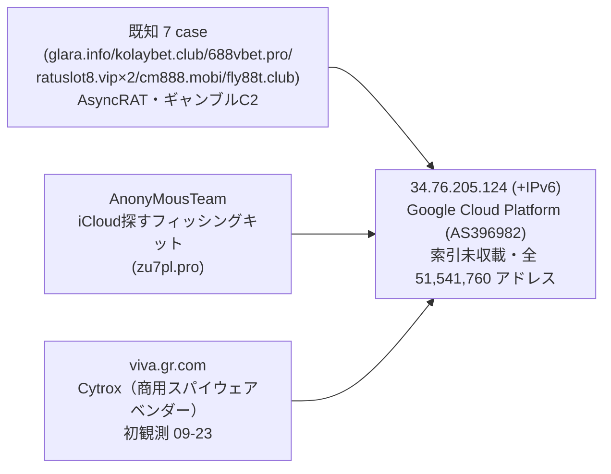
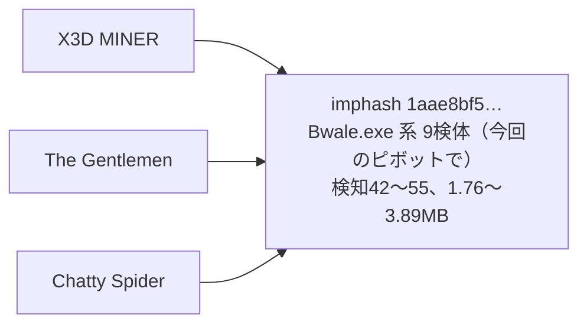

> **このレポートは AI（Claude）が自動生成したものです。人の確認を前提としてください。**

# 週次レポート 2026-W39（2026-09-19 〜 2026-09-26）

## 見つかったもの

### ドメインの生存と切り替わり

**証明書記録の再収集（apex 136、7 日以上引いていなかった全件）は今週は薄い。** 新規の
追う価値のある兄弟はわずか 8 件（`crtname-meta.json` 240 → 248 kept）で、共用基盤の
新規判定は無し（先週と同じ 7 apex: `dropboxusercontent.com` `42web.io`
`chickenkiller.com` `netcup.net` `ydns.eu` `4nmn.com` `cpolar.top`）。8 件のうち
7 件は今週初めて役割つきになった新規 apex **`alpharush.ai`（NanoCore RAT の
`nanocore_configured_controller`）** から出た兄弟（`docs` `manage` `qh88` `sitemap`
`sitemaps` `vpn` `www.docs`）で、解決できたのは `docs.alpharush.ai` の 1 件のみ
（Cloudflare 経由、`104.21.59.117` ほか）。残りは未解決か CDN の裏で、クラスタリングの
材料にはならない（弱い）。残り 1 件は既知 apex `szpd.info` に増えた `rc.szpd.info`。

**`as.svtt.top`（AsyncRAT、`configured_c2`）が 09-21 に生き返り、09-24 まで
`103.67.163.201`（EZ Technology Company Limited、AS150895、越南、17,920 アドレス・
索引の既知 IOC 2 件のみ）に解決した後、09-25 に再び nxdomain へ落ちた。** このドメインは
先週報告した `szpd.info` と**まったく同じ case ID**（`633ebe09…`）を持つ、同一
AsyncRAT 設定ファイルの別の C2 ドメインで、新しい実体ではない。ただし着地した
AS150895 は索引にほとんど登場しない小規模事業者で、次のピボットの的候補にはなる
（「そこから得られそうなもの」参照）。

**`illoskanawer.com`（Latrodectus、`c2_or_network_ioc`、新規 case `5d36d2cb…`）が
09-22 に nxdomain から生き返り、AWS（AS16509、CDN）の裏で稼働を続けている。** 先週までに
報告済みの `carflotyup.com`（同じ Latrodectus ファミリだが別 case `a459ce4b…`）とは
別件で、どちらも CDN の裏なのでインフラの重なりは確認できない（弱い）。生存ドメインに
新たに索引外の検体 2 件が付いた。

**`777palm.com`（StealC、`c2_domain_from_static_config`、08-16 から継続追跡）に
索引外の検体が 111 件付いた。** 検知 60 前後の高い判定が並び、既存の長期追跡ドメインに
まとまった量の新規検体が可視化された週になった（「そこから得られそうなもの」参照）。

**毎日組の `iuqerfsodp9…wergwff.com`（WannaCry killswitch のシンクホール）が今週は
`208.91.197.0/24`（Confluence Networks、AS40034）を離れ、`216.245.197.0/24`
（Limestone Networks、AS46475）と `77.247.179.0/24`（NForce Entertainment、AS43350）
の間で毎日ローテーションしていた。** 7 日中 6〜7 日で動く毎日組であり、**切り替わりでは
なく構成そのもの**という位置づけは変わらない（所見にはしない）。`app.business-data-leaks.com`
`app.ep6pheij.com` も今週それぞれ 8 AS・9 AS を毎日入れ替えており、先週までと同じ動き。

判定保留は 161 / 9022（1.8%）で、5% を大きく下回る。

## つながったもの

### `34.76.205.124`（GCP）の共有ノードに、初めて種類の違う実体が合流した

先週まで「案件（`case:`）ベースで 6 件 + フィッシングキット 1 件」が同居していた同じ
固定 IP に、**今週 `viva.gr.com` という新しいホストが加わった。** 索引側の紐付けは
`Cytrox`（商用スパイウェア Predator の開発元として知られるベンダー）への
`観測アクター`タグで、AsyncRAT のローダ群やギャンブル C2、フィッシングキットとは
**まったく異質な実体**が同じ /32 に着地したことになる。ホスト総数は 76 のまま
（案件数の増減は無し）で変わっていない。

ただし 2 点の留保がある。**`観測アクター` という関係は `pivot.mjs` 自身が
根拠として弱すぎるため除外している関係種別**であり、`gr.com` は公開接尾辞一覧上の
私設サフィックス（CentralNic が提供する「ブランド名.gr.com」型の登録単位）で、
`viva.gr.com` は独立した登録者の可能性がある。**AS396982 自体が 5,146 万アドレスの
巨大事業者である点も先週と変わらない。** それでも「同じ厳密な 1 個の IP に、週を追うごとに
毛色の違う実体が積み増され続けている」という継続的な傾向そのものは、単発の相乗りより
強い材料として残しておく価値がある（弱いが妥当）。

### "Bwale" ローダの imphash が今週も複数アクターを跨いで再確認された

先週報告した `X3D MINER ↔ vectra` `The Gentlemen ↔ vectra` `UAT-10147 ↔ vectra` は
今回のピボットの的（IP 120 / ドメイン 30、索引に無い検体を新規 2,160 件回収）には
`vectra` 側の検体が含まれず橋として出なかった（**的が変わったための欠落で、関係が
消えたという意味ではない**）。一方 `Chatty Spider ↔ X3D MINER` と
`Chatty Spider ↔ The Gentlemen` は同じ imphash（`1aae8bf5…`）で今週も 9 検体が
再確認できた。**検知 42〜55（引き続き低くない）・サイズ 1.76〜3.89 MB（2.2 倍）**で
先週の像（1.9 倍・検知 35〜56）とほぼ同じ帯に収まる。名前は `ftuarit` のような
乱数風の名前に加え、`locker_28f3cl_windows_386.exe`（ランサムウェアを匂わせる名前）や
`Ableton Live 12 Suite License.exe` / `Modartt Pianoteq 9.exe`（海賊版ソフトを装う
名前）が混在しており、**複数の配布ルアーの下で同じローダが使い回されている**という
先週の「共有ローダ・共有ビルダー」説をそのまま支持する（value_spread 9 IOC / 2 アクター、
広すぎない）。

## そこから得られそうなもの

- **`as.svtt.top` が着地した `103.67.163.201`（EZ Technology Company Limited、
  AS150895、17,920 アドレス）は索引の既知 IOC が 2 件だけの小規模 AS。** 先週
  `208.91.197.39`（Confluence Networks）を的候補として挙げた際は今週までに索引へ
  吸収された形跡がある（`szpd.info` の解決先として「索引にある」扱いに変わっていた）ので、
  同じやり方で AS150895 も次回の手動の的に加える価値がある（妥当）
- **`777palm.com`（StealC）の索引外検体 111 件は、既存の長期追跡ドメインとしては
  今週いちばんまとまった量。** 検知 60 前後で低くなく、次のピボットの入り口として
  優先度が高い（妥当）
- **`illoskanawer.com`（Latrodectus、新規 case）の索引外検体 2 件**は量は薄いが、
  09-22 に生き返ったばかりのドメインに付いた最初の材料であり、来週以降の推移を見る価値
  がある（材料不足だが妥当な範囲）
- 生存ドメインに付いた索引外の検体は 37 ドメインに広がった（先週は 5 件のみ言及）。
  上位は `track.tiara.kakao.com`（120、役割なし、CDN）`pool.hashvault.pro`
  （120、役割なし、公開マイニングプール、CDN）`modedapk.net`（120、役割なし、CDN）
  `www.nd9c887r.com`（23）`www.damaix9k.com`（21）`aeya388.club`（20）で、
  いずれも役割の主張が無く（`role:—`）、単独では追う理由にならない

## 疑い

**今週のピボットはガードを通った組が 14 組（既知 2 / 新規 12）。** `fetch-pivot.mjs
--targets 150`（IP 120 / ドメイン 30）を 1 回実行し、索引に無い検体を新規 2,160 件回収、
写し 300 件を照合した。40 組の生の橋のうち 26 組がガードで落ちた。先週の 21 組より
少ないが、**的にした IP/ドメインの組み合わせが毎週入れ替わることによる欠落で、
判断が覆ったという意味ではない**（`vectra` 関連 3 組・`UNK_DeadDrop` 関連 2 組・
`Myxa VPN ↔ TA4922` などが今回は的に含まれず出てこなかった）。

**`Golden Chickens ↔ KongTuke`（vhash `c0898bab…`、新規）は却下が妥当。** 先週
`KongTuke ↔ Qilin` / `KongTuke ↔ TAG-195` を「Windows Installer 49,152 byte
完全一致、弱いが妥当」としていたクラスタに、今週 `Golden Chickens` が同じ vhash で
加わった。**しかし同じ vhash を持つ 5 検体の内訳を洗うと、`go123151r.exe` /
`yentk6l1.exe`（49,152 byte）`Ca.msi`（48,128 byte）に対し、索引側の既知検体
`update.msi`（512,000 byte、検知35）と `update.msi` / `vjo0xg.exe`（1,298,432 byte、
検知37、VT自動命名 `trojan.loader/jbpm`）が混じっており、サイズが 48 KB 〜 1.3 MB と
**27 倍に開いている**。** 名前も `update.msi` が使い回されている以外は個体ごとに
バラバラで、vhash が拾っているのは Windows Installer の汎用ラッパー構造であって、
アクター間の実体共有ではないとみるのが妥当（新規の判断、却下）。`Golden Chickens` が
ローダ販売元として複数の攻撃者に道具を卸すこと自体は文献的にあり得るが、**この証拠では
それを裏付けられない**。

**`APT29 sub-cluster / GTG-20006 / Rognar ↔ UNC6240`（imphash `4e2bd2c4…`）は
様子見を継続するが、材料の広がりに注意が要る。** 先週は 2 検体・6.10〜6.12 MB という
狭い帯だったが、今週は同じ imphash に 4 検体（`sinegis.exe` 20.2 MB、
`svchost32.exe` 8.1 MB を追加）が付き、**サイズは 6.1〜20.2 MB と 3.3 倍に広がった。**
`svchost32.exe` は極めてありふれた偽装名でもあり、狭い帯という support 材料が
弱まっている点は先週からの後退として書き残す（進展というより注意信号、様子見継続）。

主な組の再確認は以下のとおり（14 組中、支持件数の大きい順。値ベースで集約）。

| 組 | 値 | value_spread | 今週確認した中身 | 判断 |
| --- | --- | --- | --- | --- |
| Chatty Spider ↔ X3D MINER | imphash | 9 IOC / 2 アクター | 9 検体、`Bwale.exe`系ローダ、1.76〜3.89 MB、検知42〜55 | 妥当（先週から継続、帯は同水準） |
| Chatty Spider ↔ The Gentlemen | imphash | 9 IOC / 2 アクター | 同上（同一 imphash） | 妥当（同上） |
| SMOKE#SCREEN ↔ Storm-2949 | vhash | 3 IOC / 1 アクター | `ScreenConnect.ClientSetup.exe`（実在 RMM） | 却下維持 |
| Golden Chickens ↔ KongTuke | vhash | 5 IOC / 1 アクター | Windows Installer、48 KB〜1.3 MB（27倍） | 却下が妥当（新規の判断、汎用ラッパー） |
| KongTuke ↔ Qilin | vhash | 5 IOC / 1 アクター | 同上（同一 vhash） | 却下に変更（先週の「弱いが妥当」から後退） |
| KongTuke ↔ TAG-195 | vhash | 5 IOC / 1 アクター | 同上（同一 vhash） | 却下に変更（同上） |
| APT29 sub-cluster ↔ UNC6240 | imphash | 4 IOC / 3 アクター | 4 検体（2→4 に増加）、6.1〜20.2 MB（3.3倍に拡大） | 様子見継続（帯が広がり注意） |
| GTG-20006 ↔ UNC6240 | imphash | 4 IOC / 3 アクター | 同上（同一 imphash） | 様子見継続（同上） |
| Rognar ↔ UNC6240 | imphash | 4 IOC / 3 アクター | 同上（同一 imphash） | 様子見継続（同上） |
| APT37 ↔ Chatty Spider | imphash | 4 IOC / 1 アクター | 1 検体が 6 系統の脅威ラベルを同時に持つ（先週と同一） | 却下維持 |
| APT37 ↔ Myxa VPN | imphash | 4 IOC / 1 アクター | 同上（同一 imphash） | 却下維持 |
| Chatty Spider ↔ GreyVibe | imphash | 4 IOC / 1 アクター | `1qIh0OG9LBRng37HofIABjHl.exe`（先週と同一） | 材料不足で判断保留（維持） |
| Gambling Goblin ↔ Myxa VPN | vhash | 5 IOC / 1 アクター | `d7s5f2.exe`（先週と同一、`rclone`構造ハッシュ共有） | 却下維持 |
| Storm-2949 ↔ The Gentlemen | imphash | 3 IOC / 2 アクター | `tor-relay-scanner-go-windows-amd64.exe`（実在 OSS、先週と同一検体） | 却下維持 |

**「毎日組」は 113 件（観測 7 日、うち 4 日以上動いたもの）。** 追跡対象が先週の
8975 件から 8983 件に増えた分を除けば、内訳は先週と同じ顔ぶれ
（`iuqerfsodp9…wergwff.com` 系・`gist.github.com`・`app.business-data-leaks.com`・
`app.ep6pheij.com`）。**これらを所見にはしない。**`iuqerfsodp9…wergwff.com` 系が
今週は `208.91.197.0/24` を離れて 2 つの別ブロックに移った点は上の「見つかったもの」
に事実として記録したが、毎日組という位置づけ自体は変わらないため疑いの対象にはしない。
