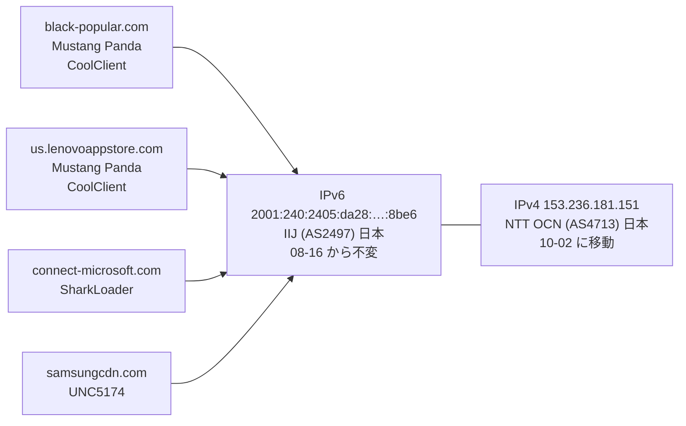
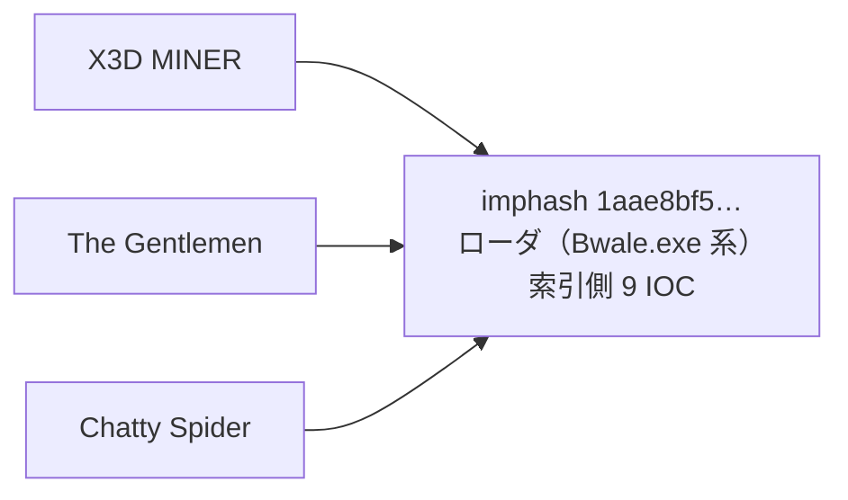

> **このレポートは AI（Claude）が自動生成したものです。人の確認を前提としてください。**

# 週次レポート 2026-W40（2026-09-26 〜 2026-10-03）

## 見つかったもの

### ドメインの生存と切り替わり

**証明書記録の再収集（apex 142、全件）は今週は薄い。** 追う価値のある兄弟は
248 → 256 件（+8、兄弟を持つ apex は 24）。8 件はすべて今週初めて役割つきになった
新規 apex **`s666hn.com`（`C2/通信`）** から出たもの（`app` `crm` `lime` `m`
`sitemap` `sitemaps` `vpn` `vpn1`）で、**8 / 8 件とも nxdomain**。apex 自体は
Cloudflare（`104.21.44.114` `172.67.199.69`）の裏で生きており、クラスタリングの
材料にはならない（弱い）。共用基盤の新規判定は無し（先週と同じ 7 apex）。

**役割つきドメインの動きは小さい。** 役割つきで状態が変わったのは次のとおり。

- `rororo2323.bounceme.net`（`configured_c2`、動的 DNS）: 09-24 に alive → no_answer、
  翌 09-25 に生き返り。1 日の揺れで、切り替わりとは読まない
- `sundanish.freeddns.org`（`c2`、動的 DNS）: 10-02 に alive → parked
- `glara.info` の兄弟 3 件が 10-02〜03 に落ちた（`config.glara.info` と `test.glara.info`
  が alive → no_answer、`www.config.glara.info` が nxdomain）。兄弟 63 件のうち
  54 件は今も `34.76.205.124` に居る
- `as.svtt.top`（AsyncRAT）の nxdomain 化（09-25）は先週報告済みで、今週の新規ではない
- `cnc.nomeum.net`（`C2/通信`）は 09-28 と 10-02 に IP が入れ替わったが、いずれも
  Amazon 内（AS14618）で、移動ではない

**`iuqerfsodp9…wergwff.com` 系（WannaCry killswitch のシンクホール、毎日組）は先週と
同じ動きを続けている**（`216.245.197.41`〜`45`＝Limestone Networks、AS46475 と
`77.247.179.82`〜`88`＝NForce Entertainment、AS43350 の間を毎日ローテーション）。
所見にはしない。

判定保留は 161 / 9,098（1.8%）で、5% を大きく下回る。

## つながったもの

### `153.236.181.151` に、別々のアクター・マルウェアに帰属された 4 ドメインが同じ IPv6 とともに居る

**4 ドメインは索引上、Mustang Panda（`black-popular.com` と `us.lenovoappstore.com`、
HoneyMyte の CoolClient 記事）・SharkLoader（`connect-microsoft.com`）・UNC5174
（`samsungcdn.com`）に別々に帰属されているが、観測では 4 / 9,098 ホストが同じ
IPv4・同じ IPv6 に居る。** IPv6 `2001:240:2405:da28:4ff0:f8ed:45ed:8be6` は
08-16 の観測開始から変わらず、IPv4 だけが NTT OCN 内で入れ替わる（下の「疑い」）。
この IP は索引に無い（索引の IPv4 4,045 件に無く、`153.236.181.0/24` も無い）。
`samsungcdn.com` は 09-23 から追跡に入り、10-02 の移動からは 4 件で揃って動いた。
同居という事実は確かだが、アクター間の関係を示すものではない（妥当な事実、解釈は弱い）。

### "Bwale" ローダの imphash が今週も 2 アクターを跨いで再確認された

今回のピボット（的 IP 120 / ドメイン 30、写し 300 件、索引に無い検体を新規 2,184 件回収）で
`Chatty Spider ↔ X3D MINER`（根拠 20 件）と `Chatty Spider ↔ The Gentlemen`
（根拠 12 件）が同じ imphash `1aae8bf5…`（`186.101.193.110` 経由）で再び通った。
`value_spread` は 9 IOC / 2 アクターで先週と同じ。**ただし今週の写しで再確認できた
検体は 1 件（`ftuarit`、2,468,352 byte、検知 50）だけで、帯（先週は 9 検体・
1.76〜3.89 MB・検知 42〜55）は今週は測り直せていない。** 先週の「共有ローダ」説は
維持するが、今週新たに加わった根拠は無い（妥当、先週値の引き継ぎ）。

## そこから得られそうなもの

- **`153.236.181.151`（NTT OCN）を次回の手動の的に加える（妥当）。** 上の 4 ドメインが
  居る IPv4 で、索引に無い。IPv4 は 5 回入れ替わっており（`58.91.120.83` →
  `114.168.146.131` → `153.235.185.171` → `153.248.34.77` → `58.91.99.114` →
  `153.236.181.151`）、過去の IP も的の候補になる
- **兄弟が固まっている IP はどれも先週までと同じで、新しい足場は今週は無い。**
  兄弟 256 件のうち IP に解決した 184 件は `34.76.205.124`（64、`glara.info`
  `kolaybet.club` `fly88t.club`）・`216.245.197.41/43/44`・`77.247.179.87/88`
  （`iuqerfsodp9…`、毎日組）・`208.91.197.39`（12、`szpd.info`）・`34.41.139.193`
  （9、`websencl.com`）・`146.70.81.56`（8、`asecdns.com`）が上位で、いずれも
  索引に IP としては無い。`146.70.81.56` の /24 だけは索引に居り（`146.70.81.218`、
  Candiru）、これも先週までに報告済み
- 生存ドメインに付いた索引外の検体は 11 ドメイン。役割つきは
  `dl.dropboxusercontent.com`（`dead_drop_configuration`、120 件で上限に達している）と
  `www.iuqerfsodp9…wergwff.com`（`C2/通信`、120 件で上限、毎日組）の 2 つだけで、
  どちらも共用基盤と毎日組なので入口としては弱い。残りは役割なしで、
  `api.wirevpn.app`（28 件）`3w.jxuw3.com`（40 件）が量の多いほう。単独では追う理由に
  ならない

## 疑い

**`153.236.181.151` の 4 ドメインは「4 つの別アクターの C2」ではなく、1 台の同じ
ホスト（または同じ運用者の環境）と読むほうが自然（仮説）。** 根拠は 3 点ある。

- 08-16 の観測開始以来、**4 件が毎回同じ日に同じ IP へ動く**（IPv4 の変更は
  08-18・09-16・09-17・09-18・10-02 の 5 回、いずれも NTT OCN（AS4713）の別アドレスへ。
  IPv6 は IIJ（AS2497）で不変）
- IPv4 が 48 日で 5 回替わるのは、固定の C2 基盤ではなく動的に割り当てられる回線
  （家庭・小規模拠点向け）の挙動に近い
- `black-popular.com` と `connect-microsoft.com` は過去に `*.sinkhole.yourtrap.com`
  への CNAME が付いていた（`black-popular.com` は 08-22/23、`connect-microsoft.com` は
  09-15/16）

ここから言えるのは「索引が別々の記事から拾った 3 系統のドメインが、同じ 1 つの場所に
解決している」ことまでで、シンクホールか研究用の受け皿か、実際の運用基盤かは
区別できない。**4 件を 1 アクターの基盤とも、3 アクターの共有とも結論しない。**

**今週のピボットはガードを通った組が 13 組（既知 2 / 新規 11）。** 的 150（IP 120 /
ドメイン 30）を引き、生の橋 39 組のうち 26 組がガードで落ちた。

| 組 | 値 | value_spread | 今週確認した中身 | 判断 |
| --- | --- | --- | --- | --- |
| Chatty Spider ↔ X3D MINER | imphash | 9 IOC / 2 アクター | `ftuarit` 2,468,352 B・検知 50（帯は未再測） | 妥当（先週から継続） |
| Chatty Spider ↔ The Gentlemen | imphash | 9 IOC / 2 アクター | 同上（同一 imphash） | 妥当（同上） |
| SMOKE#SCREEN ↔ Storm-2949 | vhash | 3 IOC / 1 アクター | `ScreenConnect.ClientSetup.exe` 5,873,112 B・検知 43（実在 RMM） | 却下維持 |
| Golden Chickens ↔ KongTuke | vhash | 5 IOC / 1 アクター | Windows Installer、今週の 2 検体は 49,152 B（`go123151r.exe` `yentk6l1.exe`） | 却下維持（先週の 48 KB〜1.3 MB の開きは今週は測り直せていない） |
| KongTuke ↔ Qilin | vhash | 5 IOC / 1 アクター | 同上（同一 vhash） | 却下維持 |
| KongTuke ↔ TAG-195 | vhash | 5 IOC / 1 アクター | 同上（同一 vhash） | 却下維持 |
| APT37 ↔ Chatty Spider | imphash | 4 IOC / 1 アクター | 2 検体（961,024 B と 1,212,416 B、検知 48 / 34） | 却下維持（先週は 1 検体が 6 系統の脅威ラベルを同時に持っていた） |
| APT37 ↔ Myxa VPN | imphash | 4 IOC / 1 アクター | 同上（同一 imphash） | 却下維持 |
| Chatty Spider ↔ GreyVibe | imphash | 4 IOC / 1 アクター | `1qIh0OG9LBRng37HofIABjHl.exe` 820,171 B・検知 30（先週と同一） | 材料不足で判断保留（維持） |
| Gambling Goblin ↔ Myxa VPN | vhash | 7 IOC / 2 アクター | `d7s5f2.exe`（ELF 7,774,392 B・検知 5）。同じ vhash に `dlkp175y.exe` `44tz7yhul.exe`（ELF 6,430,904 B・検知 39〜40）が居る。rclone の構造ハッシュ | 却下維持 |
| Myxa VPN ↔ masterblack | vhash | 7 IOC / 2 アクター | 上と同一の vhash（新たに `masterblack` が加わった） | 却下（rclone 構造、汎用ツール） |
| Myxa VPN ↔ TA4922 | imphash | 6 IOC / 1 アクター | `jqu5zj.exe` 13,720,550 B・検知 9（1 検体のみ） | 材料不足で判断保留（先週は的に含まれず今週再登場） |
| Storm-2949 ↔ The Gentlemen | imphash | 3 IOC / 2 アクター | `tor-relay-scanner-go-windows-amd64.exe`（実在 OSS、先週と同一検体） | 却下維持 |

先週の `APT29 sub-cluster / GTG-20006 / Rognar ↔ UNC6240`（様子見）は今週の的に
含まれず出てこなかった。**関係が消えたのではなく的が変わったための欠落**で、判断は
更新できない。`Myxa VPN ↔ masterblack` と `Myxa VPN ↔ TA4922` が新しく出た組だが、
どちらも上の理由で所見にはしない。

**「毎日組」は 217 件（観測 7 日のうち 4 日以上動いたもの、追跡 9,098 件中。先週は
113 件）。** 一覧の先頭 20 件は `iuqerfsodp9…wergwff.com` の子（追跡 80 件）と、
Google・Microsoft・Vercel・S3 といった事業者の名前の入れ替わりで、先週と同じ性質。
増えた理由は調べていない。
`iuqerfsodp9…` 系の AS 入れ替わり（`216.245.197.x` ↔ `77.247.179.x`）は
所見にしない。
