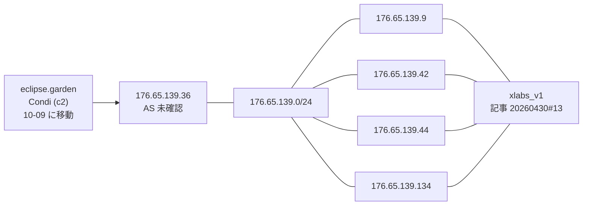
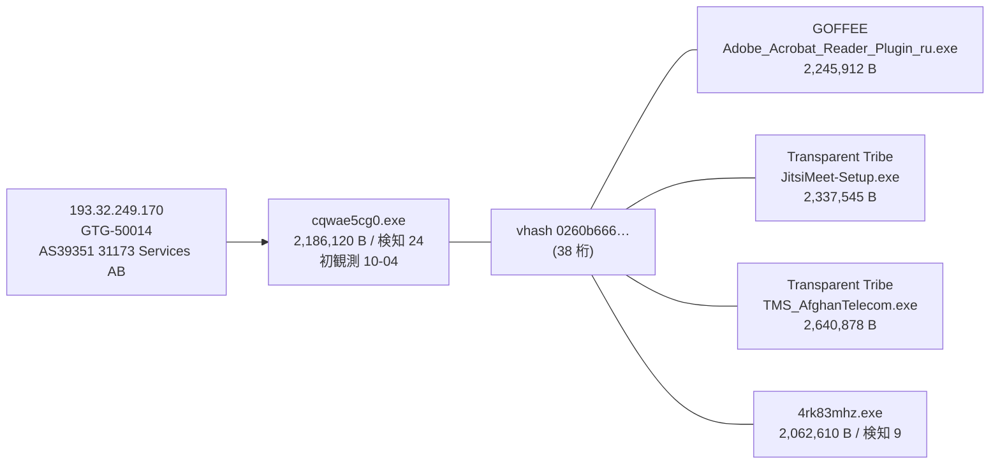
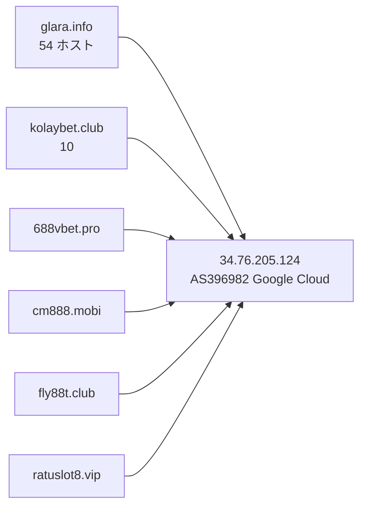

> **このレポートは AI（Claude）が自動生成したものです。人の確認を前提としてください。**

# 週次レポート 2026-W41（2026-10-03 〜 2026-10-10）

## 見つかったもの

### ドメインの生存と切り替わり

**今週のトラッカー（追跡 9,283 ドメイン、観測 7 日）は、役割つきでは薄い。**
「行き先が変わった」2,803 件のうち、役割つきで IPv4 が実際に変わったのは
49 件・12 ホストで、そのうち事業者・毎日組の印が無いのは 4 ホストだけ。

**この週の数字は 10-08 を境に読み方が変わる（測定側の問題）。** 10-07 までは
1,221〜1,222 ホストに AAAA が返り、175 ホストに CNAME が付いていたが、
**10-08 以降の観測では AAAA が 0 / 9,244、CNAME が 0 件**になった
（解決器に 8.8.8.8 経由で `google.com` の AAAA を引いても `ENODATA`）。
10-08 の変化 1,427 件は他の日（208〜256 件）の 6 倍で、IPv6 だけが消えた
1,226 件（週の「行き先が変わった」の 44%）と、「別名の向き先が変わった」214 件の
大半はこれ。**10-08 以降の IPv6 と CNAME の変化は所見にしない。**

IPv4 の変化で見るべき役割つき 4 ホスト:

- **`eclipse.garden`（`c2`、Condi）が 10-09 に Cloudflare（`104.21.0.212`
  `172.67.128.76`、08-24 から）を外れ、素の `176.65.139.36` に移った。**
  それ以前は `94.154.43.84`（08-24 まで）。移動先の AS は写しに無く未確認。
  同じ /24 に索引の IP が 4 件ある（「つながったもの」）
- **`logs.uvexio.com`（PureLogs C2）が 10-07 に `124.198.131.137` から
  `64.89.160.210` へ移った。** どちらも索引に無く、/24 も索引に無い。AS 未確認
- `cnc.nomeum.net`（`C2/通信`、mirai）は 10-04・10-05・10-10 に IP の集合が一部入れ替わった
  が、先週と同じく Amazon のアドレス内で、移動ではない
- `dl.dropboxusercontent.com` は共用基盤で、IP の入れ替わり（10-07）は所見にならない

**落ちたもの。** 役割つきは 2 件: `789betapps.com`（`configured_c2`）が 10-08 に
alive → nxdomain になり、**証明書の記録から出た兄弟 15 / 15 件も nxdomain**
（apex ごと畳まれたと読める）。`www.kolaybet.club`（`configured_c2`）が 10-05 に
alive → no_answer になったが、`kolaybet.club` の兄弟 9 / 9 件は今 alive で、
1 ホストの揺れ。落ちた 76 件の残りは役割なし。
**生き返った 17 件はすべて役割なし**（役割つきの復活は無い）。

### 証明書の記録から出た兄弟

**今週は動いていない。** 追う価値のある兄弟は 256 → 256 件で、ホスト名の
集合も先週と同一（新規 0 / 消失 0）。共用基盤と判定された apex も先週と同じ 7 で、
新規は無い（`dropboxusercontent.com` `42web.io` `chickenkiller.com` `netcup.net`
`ydns.eu` `4nmn.com` `cpolar.top`）。256 件の今の状態は alive 182 / nxdomain 65 /
no_answer 9。

## つながったもの

### `176.65.139.36`（`eclipse.garden`）は、索引上の `xlabs_v1` の IP と同じ /24

索引の 4 IP は同じ記事（2026-04-30）で `xlabs_v1` に帰属されている。`eclipse.garden`
は Condi で、マルウェアは違う。**同じ /24 に居るという事実だけ**（妥当な事実、
同一運用者かどうかは弱い）。

### 新しい検体 `cqwae5cg0.exe` が、GOFFEE / Transparent Tribe と同じ vhash でアクター
GTG-50014 の IP に出てきた

`GOFFEE ↔ GTG-50014`・`GTG-50014 ↔ Transparent Tribe` は索引上すでに結ばれている組
で、新しい関係ではなく**補強**。`value_spread` は 5 IOC / 2 アクター、5 検体の
サイズは 2.06〜2.64 MB の 1.3 倍の幅に収まり、名前は偽インストーラ（Adobe の
プラグイン・Jitsi・通信事業者名）で揃っている。**汎用スタブの形ではない（妥当）。**
同じ検体は imphash `88016fcd…` でも 11 IOC / 4 アクターに広がるが、そちらは
2.0〜65.9 MB と桁が開いており却下（「疑い」の表）。

### `34.76.205.124`（Google Cloud）に、役割つき 6 apex が同居している

追跡 70 ホストが解決している（先週 71）。`glara.info` の兄弟は 53 / 63 件がここ、
残りは no_answer 8・nxdomain 2。`glara.info` `kolaybet.club` `fly88t.club` は
索引上いずれも AsyncRAT の別々の case に属する。**IP は索引に無く、/24 も無い**
（先週までと同じ足場）。賭博系の名前で揃っており、同一運用の可能性は妥当。
このほか同じ IP に `viva.gr.com`、`zu7pl.pro`（AnonyMousTeam）が居るが、`gr.com` は
共有の接尾辞なので材料にしない。

## そこから得られそうなもの

- **`176.65.139.36` と `64.89.160.210` を次回の手動の的に加える（妥当）。**
  どちらも今週動いた役割つきドメインの移動先で、IP は索引に無い。
  `176.65.139.0/24` は索引の `xlabs_v1` の 4 IP を持つ。なお AS は写しに無く、
  経路表の取り直し後に確認する
- **`193.32.249.170` の検体 `cqwae5cg0.exe`（初観測 10-04、検知 24）。** 索引に
  無い新しい検体で、vhash `0260b666…` を軸に同族を追える（妥当）。vhash の
  検体数は小さく（5）、網羅はできていない
- **兄弟が固まっている IP に、新しい足場は今週は無い。** 256 件のうち IP に
  解決した 182 件の上位は `34.76.205.124`（62）・`103.224.182.216`（59、毎日組
  `iuqerfsodp9…`）・`185.53.179.200`（18、同）・`208.91.197.39`（12、`szpd.info`）・
  `34.41.139.193`（9、`websencl.com`）・`146.70.81.56`（8、`asecdns.com`）で、
  いずれも索引に IP としては無い。`146.70.81.56` の /24 は索引にあり
  （`146.70.81.218`、Candiru）、先週までに報告済み
- **生存ドメインに付いた索引外の検体は 11 ドメイン。** 役割つきは
  `dl.dropboxusercontent.com`（`dead_drop_configuration`）と
  `www.iuqerfsodp9…wergwff.com`（`C2/通信`）の 2 つで、どちらも 120 件の上限に
  達していて、共用基盤・毎日組なので入口としては弱い。残りは役割なしで、
  `3w.jxuw3.com`（42 件）が量の多いほう。単独では追う理由にならない

## 疑い

**`black-popular.com` `us.lenovoappstore.com` `connect-microsoft.com`
`samsungcdn.com` が `153.236.181.151` に同居している、という先週の「つながった
もの」は取り下げる（妥当）。** 10-02 と 10-07 の観測で **4 / 4 件すべてが
`*.sinkhole.yourtrap.com` への CNAME を持っていた**（`black-popular.com` は
`chollima.sinkhole.yourtrap.com`、残り 3 件は `a.sinkhole.yourtrap.com`）。
`153.236.181.151` はこのシンクホールの答えで、4 つの別アクターが同じホストを
使っていた証拠ではない。IPv4 が 5 回入れ替わるのも、シンクホール運用者の回線側の挙動と
読める（先週の「疑い」にあった仮説の、より強い裏付け）。10-08 に CNAME が消えて
見えるのは測定側の問題（上記）で、シンクホールが外れたとは言えない。
**この 4 件を 1 つの基盤とも、3 アクターの共有とも読まない。**

**`34.41.139.193`（Google Cloud）に、追跡 80 ホスト・58 apex が居て、索引は
そのうち 15 アクターに帰属している**（Lazarus・APT28・Ghostwriter・Anonymous・
UNC5174 など。先週と同じ 80 ホストで今週の変化は無い）。別々のアクターの
ドメインがこれだけ 1 つの IP に集まるのは、運用基盤の共有というより、**失効・
押収したドメインの受け皿（シンクホールや駐車）と読むほうが自然（仮説）**。
`websencl.com`（9 兄弟）はこの中の 1 つで、ここから他アクターとの関係は引けない。

**今週のピボット**は、的 150（IP 120 / ドメイン 30）、写し 300 件、索引に無い検体
2,188 件を回収し、生の橋 43 組のうち 26 組がガードで落ち、17 組が通った
（既知 5 / 新規 12）。

| 組 | 値 | value_spread | 今週確認した中身 | 判断 |
| --- | --- | --- | --- | --- |
| GTG-50014 ↔ Transparent Tribe / GOFFEE | vhash `0260b666…` | 5 IOC / 2 アクター | 2.06〜2.64 MB・偽インストーラ（「つながったもの」） | 妥当（既知の関係の補強） |
| GTG-50014 ↔ PhantomEnigma / Rognar | imphash `88016fcd…` | 11 IOC / 4 アクター | 2.0〜65.9 MB（桁違い）、名前は 1 検体ごとに違う（`JitsiMeet-Setup.exe` `MicroUpdaterV1.exe` `0a3dqJMhiA__` など） | 却下（汎用スタブ） |
| Chatty Spider ↔ X3D MINER | imphash `1aae8bf5…` | 9 IOC / 2 アクター | 1.76〜3.89 MB（9 検体）、検知 42〜55、名前は乱数＋`Ableton Live 12 Suite License.exe` | 妥当（先週から継続、今週新たな根拠は無い） |
| Chatty Spider ↔ The Gentlemen | imphash `1aae8bf5…` | 9 IOC / 2 アクター | 同上（同一 imphash） | 妥当（同上） |
| SMOKE#SCREEN ↔ Storm-2949 | vhash `05605665…` | 3 IOC / 1 アクター | `ScreenConnect.ClientSetup.exe` 5,873,112 B（実在 RMM） | 却下維持 |
| Storm-2949 ↔ The Gentlemen | imphash `c2d457ad…` | 3 IOC / 2 アクター | `tor-relay-scanner-go-windows-amd64.exe`（実在 OSS） | 却下維持 |
| Golden Chickens ↔ KongTuke / Qilin / TAG-195 | vhash `c0898bab…` | 5 IOC / 1 アクター | `update.msi` 512,000〜1,298,432 B と `Ca.msi` 48,128 B、今週の 2 検体は 49,152 B | 却下維持（サイズが 27 倍開く） |
| APT37 ↔ Chatty Spider / Myxa VPN | imphash `948cc502…` | 4 IOC / 1 アクター | 名前は複数ファミリのラベルを連結した検体フィード名、915,968〜1,212,416 B | 却下維持 |
| Chatty Spider ↔ GreyVibe | imphash `f4639a0b…` | 4 IOC / 1 アクター | 今週の検体 `1qIh0OG9LBRng37HofIABjHl.exe` は 820,171 B、索引側は 16.7〜17.5 MB（約 21 倍） | 却下（先週の「判断保留」から変更） |
| Myxa VPN ↔ masterblack / Gambling Goblin | vhash `e840a106…` | 7 IOC / 2 アクター | 5.75〜76.3 MB・名前は `rclone` `esxi` `gowitness-3.1.1-linux-amd64` など（ELF の汎用ツール） | 却下維持 |
| FortiBleed ↔ UNK_DeadDrop | vhash `77ac44bd…` | 3 IOC / 1 アクター | 3 検体、6.44〜14.66 MB（2.3 倍）、名前は乱数・sha256 名・`multipathd_04d0`。今週の検体は検知 6 | 材料不足で判断保留（新規） |

先週あった `Myxa VPN ↔ TA4922`（imphash、判断保留）は今週は出なかった。**的が変わった
ための欠落で、関係が消えたとは読まない。** 先週あった `APT29 sub-cluster / GTG-20006 /
Rognar ↔ UNC6240` も同様。

**`iuqerfsodp9…wergwff.com`（WannaCry killswitch のシンクホール、毎日組）の行き先が
先週までと変わった。** 10-04〜10-07 は `216.245.197.41〜44`（Limestone Networks）と
`77.247.179.84`（NForce Entertainment）の間を毎日回り、`www.` は 10-08 に
`216.245.197.41` へ、**10-10 に `103.224.182.216` へ移った**。追跡 60 ホストが
`103.224.182.216`（59 兄弟）、18 ホストが `185.53.179.200` に解決している。
いずれも AS は写しに無く未確認で、索引にも無い。毎日組なので所見にはしないが、
入れ替わりの集合が変わったことだけ記録する。

**「毎日組」は 228 件**（観測 7 日のうち 4 日以上動いたもの、追跡 9,283 件中。先週は
217 件）。先頭 20 件は `iuqerfsodp9…` の子と、Google・Microsoft・Vercel・S3 といった
事業者の名前の入れ替わりで、先週と同じ性質。増えた理由は調べていない。
